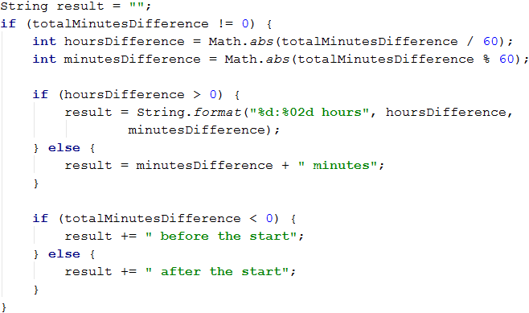
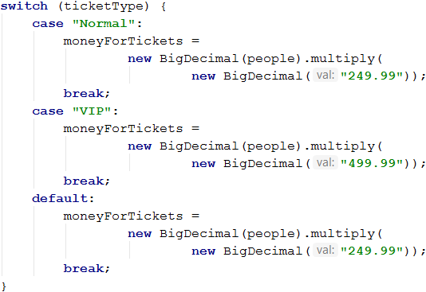
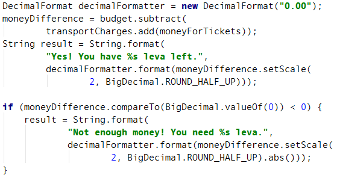
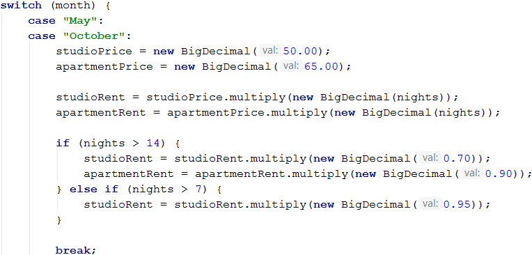
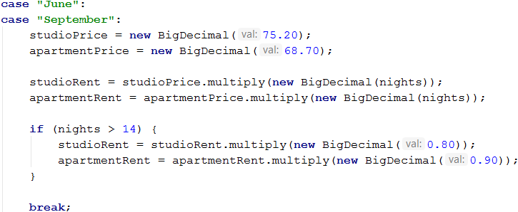

# Глава 4.2. По-сложни проверки – изпитни задачи

В предходната глава се запознахме с вложените условни конструкции в езика Java. Чрез тях програмната логика в дадена програма може да бъде представена посредством **`if` конструкции**, които се влагат една в друга. Разгледахме и условната конструкция **`switch-case`**, която позволява избор измежду списък от възможности. Следва да упражним и затвърдим наученото досега, като разгледаме няколко по-сложни задачи, давани на изпити. Преди да преминем към задачите, ще си припомним условните конструкции:

## Вложени проверки

```java
if (condition1) {
    if (condition2) {
        // тяло; 
    } else {
        // тяло;
    }
}
```

<table><tr><td></td>
<td>Не е добра практика нивото на влагане да бъде повече от три, тоест не трябва да бъдат влагани повече от три условни конструкции една в друга.</td>
</tr></table>

## Switch-case проверки

Когато работата на програмата зависи от стойността на една променлива, вместо да правим последователни проверки с множество **`if-else`** блокове, можем да използваме условната конструкция **`switch-case`**.

```java
switch (селектор) {
    case стойност1:
        конструкция;
        break;
    case стойност2:
        конструкция;
        break;
    default:
        конструкция;
        break;
}
```

Конструкцията се състои от:
* Селектор - израз, който се изчислява до някаква конкретна стойност. Типът на селектора може да бъде **цяло число**, **string** или **enum**.
* Множество **`case`** етикети.

## Изпитни задачи

### Задача: навреме за изпит

Студент трябва да отиде **на изпит в определен час** (например в 9:30 часа). Той идва в изпитната зала в даден **час на пристигане** (например 9:40). Счита се, че студентът е дошъл **навреме**, ако е пристигнал **в часа на изпита или до половин час преди това**. Ако е пристигнал **повече от 30 минути по-рано**, той е **подранил**. Ако е дошъл **след часа на изпита**, той е **закъснял**. 

Напишете програма, която въвежда време на изпит и време на пристигане и отпечатва дали студентът е дошъл **навреме**, дали е **подранил** или е **закъснял**, както и **с колко часа или минути** е подранил или закъснял.

#### Входни данни

От конзолата се четат **четири цели числа** (по едно на ред):

- Първият ред съдържа **час на изпита** – цяло число от 0 до 23.
- Вторият ред съдържа **минута на изпита** – цяло число от 0 до 59.
- Третият ред съдържа **час на пристигане** – цяло число от 0 до 23.
- Четвъртият ред съдържа **минута на пристигане** – цяло число от 0 до 59.

#### Изходни данни

На първия ред отпечатайте:

- "**Late**", ако студентът пристига **по-късно** от часа на изпита.
- "**On time**", ако студентът пристига **точно** в часа на изпита или до 30 минути по-рано.
- "**Early**", ако студентът пристига повече от 30 минути **преди** часа на изпита.

Ако студентът пристига с поне минута разлика от часа на изпита, отпечатайте на следващия ред:

- "**mm minutes before the start**" за идване по-рано с по-малко от час.
- "**hh:mm hours before the start**" за подраняване с 1 час или повече. Минутите винаги печатайте с 2 цифри, например "1:05".
- "**mm minutes after the start**" за закъснение под час.
- "**hh:mm hours after the start**" за закъснение от 1 час или повече. Минутите винаги печатайте с 2 цифри, например "1:03".

#### Примерен вход и изход

| Вход | Изход | Вход | Изход |
|---|---|---|---|
|9<br>30<br>9<br>50|Late<br>20 minutes after the start|16<br>00<br>15<br>00|Early<br>1:00 hours before the start|
|9<br>00<br>8<br>30|On time<br>30 minutes before the start|9<br>00<br>10<br>30|Late<br>1:30 hours after the start|
|14<br>00<br>13<br>55|On time<br>5 minutes before the start|11<br>30<br>8<br>12|Early<br>3:18 hours before the start|


| Вход | Изход | 
|---|---|
|10<br>00<br>10<br>00|On time|
|11<br>30<br>10<br>55|Early<br>35 minutes before the start|
|11<br>30<br>12<br>29|Late<br>59 minutes after the start|

#### Насоки и подсказки

<table><tr><td></td>
<td>Препоръчително е, преди да започнете писането на код, да прочетете няколко пъти заданието на дадена задача, като си водите записки.</td>
</tr></table>

##### Обработка на входните данни

Съгласно заданието очакваме да ни бъдат подадени **четири** поредни реда с различни **цели числа**. Разглеждайки дадените параметри можем да се спрем на типа **`int`**, тъй като той удовлетворява очакваните ни стойности. Едновременно **четем** входа и **парсваме** стринговата стойност към избрания от нас тип данни за **цяло число**.


Разглеждайки очаквания изход можем да създадем променливи, които да съдържат различните видове изходни данни, с цел да избегнем използването на т.нар. **"magic strings"** в кода.


##### Изчисления

След като прочетохме входа, можем да започнем да разписваме логиката за изчисление на резултата. Нека първо да изчислим **началния час** на изпита **в минути** за по-лесно и точно сравнение.


Нека изчислим по същата логика и **времето на пристигане** на студента.


Остава ни да пресметнем разликата в двете времена, за да можем да определим **кога** и в **какво време спрямо изпита** е пристигнал студентът.


Следващата ни стъпка е да направим необходимите **проверки и изчисления**, като накрая ще изведем резултата от тях. Нека разделим изхода на **две** части: 

- Първо да покажем кога е пристигнал студентът - дали е **подранил**, **закъснял** или е пристигнал **навреме**. За целта ще се спрем на **`if-else`** конструкция.
- След това ще покажем **времевата разлика**, ако студентът пристигне в **различно време** от началния **час на изпита**.

С цел да спестим една допълнителна проверка (**`else`**), можем по подразбиране да приемем, че студентът е закъснял. 

След което, съгласно условието, проверяваме дали разликата във времената е **повече от 30 минути**. Ако това е така, приемаме, че е **подранил**. Ако не влезем в първото условие, то следва да проверим само дали **разликата е по-малка или равна на нула (**`<= 0`**)**, с което проверяваме условието, студентът да е дошъл в рамките на от **0 до 30 минути** преди изпита. 

При всички останали случаи приемаме, че студентът е **закъснял**, което сме направили **по подразбиране**. Следователно не е нужна допълнителна проверка.


За финал ни остава да разберем и покажем с **каква разлика от времето на изпита е пристигнал** студентът, както и дали тази разлика показва време на пристигане **преди или след изпита**.

Правим проверка дали разликата ни е **над** един час, за да изпишем съответно часове и минути в желания според заданието **формат**, или е **под** един час, за да покажем **само минути** като формат и описание. 

Остава да направим още една проверка - дали времето на пристигане на студента е **преди** или **след** началото на изпита.



##### Отпечатване на резултата

Накрая остава да изведем резултата на конзолата. По задание, ако студентът е дошъл точно навреме (**без нито една минута разлика**), не трябва да изваждаме втори резултат. Затова правим следната **проверка**:


Всъщност, за целите на задачата извеждането на резултата **на конзолата** може да бъде направен и в по-ранен етап - още при самите изчисления. Това като цяло не е много добра практика. **Защо?**

Нека разгледаме идеята, че кодът ни не е 10 реда, а 100 или 1000! Някой ден ще се наложи извеждането на резултата да не бъде в конзолата, а да бъде записан във **файл** или визуализиран в **уеб приложение**. Тогава на колко места в кода ще трябва да бъдат нанесени корекции поради тази смяна? И дали няма да пропуснем някое място?

<table><tr><td></td>
<td>Винаги си мислете за кода с логически изчисления, като за отделна част от входните и изходните данни. Така че да може да работи без оглед на това как се подават данните и къде ще трябва да бъде показан резултата.</td>
</tr></table>

#### Тестване в Judge системата

Тествайте решението си тук:  [https://judge.softuni.bg/Contests/Practice/Index/654#0](https://judge.softuni.bg/Contests/Practice/Index/654#0) 

### Задача: пътешествие

Странно, но повечето хора си плануват от рано почивката. Млад програмист разполага с **определен бюджет** и свободно време в даден **сезон**.

Напишете програма, която да приема **на входа бюджета и сезона**, а **на изхода** да изкарва **къде ще почива** програмистът и **колко ще похарчи**.

Бюджетът определя дестинацията, а сезонът определя колко от бюджета ще бъде изхарчен. Ако е **лято**, ще почива на **къмпинг**, а **зимата - в хотел**. Ако е в **Европа**, независимо от сезона, ще почива в **хотел**. Всеки **къмпинг** или **хотел**, според дестинацията, има **собствена цена**, която отговаря на даден **процент от бюджета**:

- При **100 лв. или по-малко** – някъде в **България**.
  - **Лято** – **30%** от бюджета.
  - **Зима** – **70%** от бюджета.
- При **1000 лв. или по малко** – някъде на **Балканите**.
  - **Лято** – **40%** от бюджета.
  - **Зима** – **80%** от бюджета.
- При **повече от 1000 лв**. – някъде из **Европа**.
  - При пътуване из Европа, независимо от сезона, ще похарчи **90% от бюджета си**.

#### Входни данни

Входът се чете от конзолата и се състои от **два реда**:

- На **първия** ред получаваме **бюджета** - **реално число** в интервал [**10.00...5000.00**].
- На **втория** ред – **един** от двата възможни сезона: "**summer**" или "**winter**".

#### Изходни данни

На конзолата трябва да се отпечатат **два реда**.

- На **първи** ред – "**Somewhere in {дестинация}**" измежду "**Bulgaria**", "**Balkans**" и "**Europe**".
- На **втори** ред – "{**Вид почивка**} – {**Похарчена сума**}":
  - **Почивката** може да е между "**Camp**" и "**Hotel**".
  - **Сумата** трябва да е **закръглена с точност до втория символ след десетичния знак**.

#### Примерен вход и изход

| Вход | Изход |
|---|---|
|50<br>summer|Somewhere in Bulgaria<br>Camp - 15.00|
|75<br>winter|Somewhere in Bulgaria<br>Hotel - 52.50|
|312<br>summer|Somewhere in Balkans<br>Camp - 124.80|
|678.53<br>winter|Somewhere in Balkans<br>Hotel - 542.82|
|1500<br>summer|Somewhere in Europe<br>Hotel - 1350.00|

#### Насоки и подсказки

##### Обработка на входните данни

Прочитайки внимателно условието разбираме, че очакваме **два** реда с входни данни. Първият параметър е **реално число**, за което е добре да изберем подходящ тип на променливата. За по-голяма точност в изчисленията ще се спрем на **`BigDecimal`** като тип за бюджета, а за сезона - **`string`**. 


<table><tr><td></td>
<td>Винаги преценявайте какъв тип стойност се подава при входните данни, както и към какъв тип трябва да бъдат конвертирани тези данни, за да работят правилно създадените от вас програмни конструкции!</td>
</tr></table>

**Пример**: Когато в задачата е необходимо да направите парични изчисления, използвайте **`BigDecimal`** за по-голяма точност.

##### Изчисления

Нека си създадем и инициализираме нужните за логиката и изчисленията променливи.


Подобно на примера в предната задача, можем да инициализираме променливите с някои от изходните резултати - с цел спестяване на допълнително инициализиране.

Разглеждайки отново условието на задачата забелязваме, че основното разпределение за това къде ще почиваме се определя от **стойността на подадения бюджет**, т.е. основната ни логика се разделя на два случая: 
* Ако бюджетът е **по-малък** от дадена стойност.
* Ако е **по-малък** от друга стойност, или е **повече** от дадена гранична стойност. 

Спрямо това как си подредим логическата схема (в какъв ред ще обхождаме граничните стойности), ще имаме повече или по-малко проверки в условията. **Помислете защо!**

След това е необходимо да направим проверка за стойността на **подадения сезон**. Спрямо нея ще определим какъв процент от бюджета ще бъде похарчен, както и къде ще почива програмистът - в **хотел** или на **къмпинг**.

Пример за един от възможните подходи за решение е:


Винаги можем да инициализираме дадена стойност на параметъра и след това да направим само една проверка. **Това ни спестява една логическа стъпка**.

**Например блокът**


**може да бъде представен по следния начин:**


##### Отпечатване на резултата

Остава ни да покажем изчисления резултат на конзолата:


#### Тестване в Judge системата

Тествайте решението си тук: [https://judge.softuni.bg/Contests/Practice/Index/654#1](https://judge.softuni.bg/Contests/Practice/Index/654#1)

### Задача: операции между числа

Напишете програма, която чете **две цели числа (N1 и N2)** и **оператор**, с който да се извърши дадена **математическа операция** с тях. Възможните операции са: **събиране** (**`+`**), **изваждане** (**`-`**), **умножение** (**`*`**), **деление** (**`/`**) и **модулно деление** (**`%`**). При събиране, изваждане и умножение на конзолата трябва да се отпечата резултата и дали той е **четен** или **нечетен**. При обикновено деление – **единствено резултата**, а при модулно деление – **остатъка**. Трябва да се има предвид, че **делителят може да е равен на нула** (**`= 0`**), а на нула не се дели. В този случай трябва да се отпечата **специално съобщение**.

#### Входни данни

От конзолата се прочитат **3 реда**:

- **N1** – **цяло число** в интервала [**0...40 000**].
- **N2** – **цяло число** в интервала [**0...40 000**].
- **Оператор** – **един символ** измежду: "**+**", "**-**", "**\***", "**/**", "**%**".

#### Изходни данни

Да се отпечата на конзолата **един ред**:

- Ако операцията е **събиране**, **изваждaне** или **умножение**:
  - **"{N1} {оператор} {N2} = {резултат} – {even/odd}"**.
- Ако операцията е **деление**:
  - **"{N1} / {N2} = {резултат}"** – резултатът е **форматиран** до **втория символ след десетичния знак**.
- Ако операцията е **модулно деление**:
  - **"{N1} % {N2} = {остатък}"**.
- В случай на **деление на 0 (нула)**:
  - **"Cannot divide {N1} by zero"**.


#### Примерен вход и изход

| Вход | Изход | Вход | Изход |
|---|---|---|---|
|123<br>12<br>/|123 / 12 = 10.25|112<br>0<br>/|Cannot divide 112 by zero|
|10<br>3<br>%|10 % 3 = 1|10<br>0<br>%|Cannot divide 10 by zero|

| Вход | Изход |
|---|---|
|10<br>12<br>+|10 + 12 = 22 - even|
|10<br>1<br>-|10 - 1 = 9 - odd|
|7<br>3<br>\*|7 * 3 = 21 - odd|


#### Насоки и подсказки

##### Обработка на входните данни

След прочитане на условието разбираме, че очакваме **три** реда с входни данни. На първите **два** реда ни се подават **цели числа** (в указания от заданието диапазон), а на третия - **аритметичен символ**. 


##### Изчисления

Нека си създадем и инициализираме нужните за логиката и изчисленията променливи. В едната ще пазим **резултата от изчисленията**, а другата ще използваме за **крайния изход** на програмата.


Прочитайки внимателно условието разбираме, че има случаи, в които не трябва да правим **никакви** изчисления, а просто да изведем резултат.

Следователно първо може да проверим дали второто число е **`0`** (нула), както и дали операцията е **деление** или **модулно деление**, след което да инициализираме резултата.


Нека сложим резултата като стойност при инициализацията на **`output`** параметъра. По този начин може да направим само **една проверка** - дали е необходимо да **преизчислим** и **заменим** този резултат. 

Спрямо това кой подход изберем, следващата ни проверка ще бъде или обикновен **`else`** или единичен **`if`**. В тялото на тази проверка, с допълнителни проверки за начина на изчисление на резултата спрямо подадения оператор, можем да разделим логиката спрямо **структурата** на очаквания **резултат**. 

От условието можем да видим, че за **събиране** (**`+`**), **изваждане** (**`-`**) или **умножение** (**`*`**) очакваният резултат има еднаква структура: **"{N1} {оператор} {N2} = {резултат} – {even/odd}"**, докато за **деление** (**`/`**) и за **модулно деление** (**`%`**) резултатът има различна структура.


Завършваме с проверките за събиране, изваждане и умножение:


При кратки и ясни проверки, както в горния пример за четно и нечетно число, е възможно да се използва **тернарен оператор**. Нека разгледаме възможната проверка **с** и **без** тернарен оператор.

**Без използване на тернарен оператор:**


**С използване на тернарен оператор:**


##### Отпечатване на резултата

Накрая ни остава да покажем изчисления резултат на конзолата:


#### Тестване в Judge системата

Тествайте решението си тук: [https://judge.softuni.bg/Contests/Practice/Index/654#2](https://judge.softuni.bg/Contests/Practice/Index/654#2)

### Задача: билети за мач

**Група запалянковци** решили да си закупят **билети за Евро 2016**. Цената на билета се определя спрямо **две** категории:

- **VIP** – **499.99** лева
- **Normal** – **249.99** лева

Запалянковците **имат определен бюджет**, a **броят на хората** в групата определя какъв процент от бюджета трябва **да се задели за транспорт**:

- **От 1 до 4** – 75% от бюджета
- **От 5 до 9** – 60% от бюджета
- **От 10 до 24** – 50% от бюджета
- **От 25 до 49** – 40% от бюджета
- **50 или повече** – 25% от бюджета

Напишете програма, която да **пресмята дали с останалите пари от бюджета** могат да си **купят билети за избраната категория**, както и **колко пари** ще им **останат или ще са им нужни**.

#### Входни данни

Входът се чете от **конзолата** и съдържа **точно 3 реда**:

- На **първия** ред е **бюджетът** – реално число в интервала [**1 000.00 ... 1 000 000.00**.
- На **втория** ред е **категорията** – "**VIP**" или "**Normal**".
- На **третия** ред е **броят на хората в групата** – цяло число в интервала [**1 ... 200**].

#### Изходни данни

Да се **отпечата** на конзолата **един ред**:

- Ако **бюджетът е достатъчен**:
  - "**Yes! You have {N} leva left.**" – където **N са останалите пари** на групата.
- Ако **бюджетът НЕ Е достатъчен**:
  - "**Not enough money! You need {М} leva.**" – където **М е сумата, която не достига**.

**Сумите** трябва да са **форматирани с точност до два символа след десетичния знак**.

#### Примерен вход и изход

| Вход | Изход | Обяснения |
|---|---|---|
|1000<br>Normal<br>1|Yes! You have 0.01 leva left.|**1 човек : 75%** от бюджета отиват за **транспорт**.<br>**Остават:** 1000 – 750 = **250**.<br>Категория **Normal**: билетът **струва 249.99 * 1 = 249.99**<br>249.99 < 250: **остават му** 250 – 249.99 = **0.01**|

| Вход | Изход | Обяснения |
|---|---|---|
|30000<br>VIP<br>49|Not enough money! You need 6499.51 leva.|**49 човека: 40%** от бюджета отиват за **транспорт**.<br>Остават: 30000 – 12000 = 18000.<br>Категория **VIP**: билетът **струва** 499.99 * 49.<br>**24499.510000000002** < 18000.<br>**Не стигат** 24499.51 - 18000 = **6499.51**|

#### Насоки и подсказки

##### Обработка на входните данни

Нека прочетем внимателно условието и да разгледаме какво се очаква да получим като **входни данни**, какво се очаква да **върнем като резултат**, както и кои са **основните стъпки** при разбиването **на логическата схема**.

Като за начало, нека обработим и запазим входните данни в **подходящи** за това **променливи**:


##### Изчисления

Нека създадем и инициализираме нужните за изчисленията променливи:


Нека отново прегледаме условието. Трябва да направим **две** различни блок изчисления. 

От първите изчисления трябва да разберем каква част от бюджета ще трябва да заделим за **транспорт**. За логиката на тези изчисления забелязваме, че има значение единствено **броят на хората в групата**. Следователно ще направим логическата разбивка спрямо броя на запалянковците.

Ще използваме условна конструкция - поредица от **`if-else`** блокове.


От вторите изчисления трябва да намерим каква сума ще ни е необходима за закупуване на **билети за групата**. Според условието, това зависи единствено от типа на билетите, които трябва да закупим. 

Нека използваме **`switch-case`** условна конструкция.



След като сме изчислили какви са **транспортните разходи** и **разходите за билети**, ни остава да изчислим крайния резултат и да разберем **ще успее** ли групата запалянковци да отиде на Евро 2016 или **няма да успее** при така подадените параметри. 

За извеждането на резултата, за да си спестим една **`else` проверка** приемаме, че групата по подразбиране ще може да отиде на Евро 2016.



##### Отпечатване на резултата

Накрая ни остава да покажем изчисления резултат на конзолата.

#### Тестване в Judge системата

Тествайте решението си тук: [https://judge.softuni.bg/Contests/Practice/Index/654#3](https://judge.softuni.bg/Contests/Practice/Index/654#3)

### Задача: хотелска стая

Хотел предлага **два вида стаи**: **студио и апартамент**.

Напишете програма, която изчислява **цената за целия престой за студио и апартамент**. **Цените** зависят от **месеца** на престоя:

| **Май и октомври** | **Юни и септември** | **Юли и август** |
|---|---|---|
|Студио – **50** лв./нощувка|Студио – **75.20** лв./нощувка|Студио – **76** лв./нощувка|
|Апартамент – **65** лв./нощувка|Апартамент – **68.70** лв./нощувка|Апартамент – **77** лв./нощувка|

Предлагат се и следните **отстъпки**:

- За **студио**, при повече от **7** нощувки през **май и октомври**: **5%** намаление.
- За **студио**, при повече от **14** нощувки през **май и октомври**: **30%** намаление.
- За **студио**, при повече от **14** нощувки през **юни и септември**: **20%** намаление.
- За **апартамент**, при повече от **14** нощувки, **без значение от месеца: 10%** намаление.

#### Входни данни

Входът се чете от **конзолата** и съдържа **точно два реда**:

- На **първия** ред е **месецът** – May, June, July, August, September или October.
- На **втория** ред е **броят на нощувките** – цяло число в интервала [**0...200**].

#### Изходни данни

Да се **отпечатат** на конзолата **два реда**:

- На първия ред: "**Apartment: { цена за целият престой } lv**".
- На втория ред: "**Studio: { цена за целият престой } lv**".

**Цената за целия престой да е форматирана с точност до два символа след десетичния знак**.

#### Примерен вход и изход

| Вход | Изход |Обяснения |
|---|---|---|
|May<br>15|Apartment: 877.50 lv.<br>Studio: 525.00 lv.| През **май**, при повече от **14 нощувки**, намаляме цената на **студиото с 30%** (50 – 15 = 35), а на **апартамента – с 10%** (65 – 6.5 =58.5).<br>Целият престой в **апартамент – 877.50** лв.<br>Целият престой **в студио – 525.00** лв.|

| Вход | Изход |
|---|---|
|June<br>14|Apartment: 961.80 lv.<br>Studio: 1052.80 lv|
|August<br>20|Apartment: 1386.00 lv.<br>Studio: 1520.00 lv.|

#### Насоки и подсказки

##### Обработка на входните данни

Съгласно условието на задачата очакваме да получим два реда входни данни - на първия ред **месеца, през който се планува престой**, а на втория - **броя нощувки**.

Нека обработим и запазим входните данни в подходящи за това параметри:


##### Изчисления

След това да създадем и инициализираме нужните за изчисленията променливи:


Разглеждайки отново условието забелязваме, че основната ни логика зависи от това какъв **месец** ни се подава, както и от броя на **нощувките**.

Като цяло има различни подходи и начини да се направят въпросните проверки, но нека се спрем на основна условна конструкция **`switch-case`**, като в различните **`case` блокове** ще използваме условни конструкции **`if`** и **`if-else`**.

Нека започнем с първата група месеци: **Май** и **Октомври**. За тези два месеца **цената на престой е еднаква** и за двата типа настаняване - в **студио** и в **апартамент**. Следователно е необходимо да направим вътрешна проверка спрямо **броят нощувки**, за да преизчислим **съответната цена** (ако се налага).



За следващите месеци **логиката** и **изчисленията** ще са относително **идентични**. 




След като изчислихме какви са съответните цени и крайната сума за престоя - нека да си изведем резултата във форматиран вид, като преди това го запишем в изходните ни **променливи** - **`studioInfo`** и **`apartmentInfo`**.


За изчисленията на изходните параметри използваме **метода** **`java.math.BigDecimal.setScale(int newScale, RoundingMode roundingMode)`**.
Този метод **закръгля десетично** число до **зададен брой цифри** след десетичния знак като съответно имаме и управление от какъв тип да е закръглението - **`RoundingMode`**. За целта, подаваме на метода цяло число (**`int`**) с което указваме до кой знак е нужно да бъде закръглението и стойност от дадена енумерация **`RoundingMode`** (**`UP`**, **`DOWN`**, **`CEILING`**, **`FLOOR`**, **`HALF_UP`**, **`HALF_DOWN`**, **`HALF_EVEN`**). В нашия случай ще закръглим десетичното число до **две цифри** след десетичната точка с тип на закръгление **`HALF_EVEN`**.

##### Отпечатване на резултата

Накрая остава да покажем изчислените резултати на конзолата.

#### Тестване в Judge системата

Тествайте решението си тук: [https://judge.softuni.bg/Contests/Practice/Index/654#4](https://judge.softuni.bg/Contests/Practice/Index/654#4)
