# Глава 5.1. Повторения (цикли)

В настоящата глава ще се запознаем с конструкциите за **повторение на група команди**, известни в програмирането с понятието "**цикли**". Ще напишем няколко цикъла с използване на оператора **`for`** в най-простата му форма. Накрая ще решим няколко практически задачи, изискващи повторение на поредица от действия, като използваме цикли.

## Видео

  Гледайте видео-урок по тази глава тук: <a target="_blank"
  href="https://www.youtube.com/watch?v=MMLI-dGB3Ms">
  https://www.youtube.com/watch?v=MMLI-dGB3Ms</a>.

## Повторения на блокове код (for цикъл)

В програмирането често пъти се налага **да изпълним блок с команди няколко пъти**. За целта се използват т.нар. **цикли**. Нека разгледаме един пример за **`for` цикъл**: 

Цикълът започва с **оператора `for`** и преминава през всички стойности за дадена променлива в даден интервал, например всички числа от 1 до 10 включително, и за всяка стойност изпълнява поредица от команди.

В декларацията на цикъла се задава **начална стойност** и **крайна стойност**. **Тялото на цикъла** се огражда с къдрави скоби **`{ }`** и представлява блок с една или няколко команди. На фигурата по-долу е показана структурата на един **`for` цикъл**:

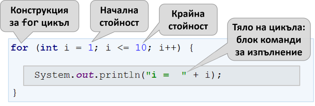

В повечето случаи един **`for` цикъл** се завърта от **`1`** до **`n`** пъти (например от 1 до 10). Целта на цикъла е да се премине последователно през числата 1, 2, 3, ..., n и за всяко от тях да се изпълни някакво действие. В примера по-горе променливата **`i`** приема стойности от 1 до 10 и в тялото на цикъла се отпечатва текущата стойност. Цикълът се повтаря 10 пъти и всяко от тези повторения се нарича "**итерация**".

### Пример: числа от 1 до 100

Да се напише програма, която **печата числата от 1 до 100**. Програмата не приема вход и отпечатва числата от 1 до 100 едно след друго, по едно на ред.

#### Насоки и подсказки

Можем да решим задачата с **`for` цикъл** , с който преминаваме с променливата **`i`** през числата от 1 до 100 и ги печатаме:

**Стартираме** програмата с [**Shift+F10**] и я **тестваме**:

#### Тестване в Judge системата

Тествайте решението си тук: [https://judge.softuni.bg/Contests/Practice/Index/655#0](https://judge.softuni.bg/Contests/Practice/Index/655#0)

Трябва да получите **100 точки** (напълно коректно решение).

## Code Snippet за for цикъл в IntelliJ IDEA

Докато програмираме, постоянно се налага да пишем цикли, десетки пъти всеки ден. Затова в повечето среди за разработка (IDE) има **шаблони за код** (**code snippets**) за писане на цикли. Един такъв шаблон е **шаблонът за `for` цикъл в IntelliJ IDEA**. Напишете **`fori`** в редактора за Java код в IntelliJ IDEA и **натиснете** [**Enter**]. IntelliJ IDEA ще разгъне за вас шаблон и ще напише цялостен **`for` цикъл**, единствено трябва да добавите крайната стойност:

**Опитайте сами**, за да усвоите умението да ползвате шаблона за код за **`for` цикъл** в IntelliJ IDEA.

### Пример: числа до 1000, завършващи на 7

Да се напише програма, която намира всички числа в интервала [**1…1000**], които завършват на 7. 

#### Насоки и подсказки

Задачата можем да решим като комбинираме **`for` цикъл** за преминаваме през числата от 1 до 1000 и **проверка** за всяко число дали завършва на 7. Има и други решения, разбира се, но нека решим задачата чрез **завъртане на цикъл + проверка**:

#### Тестване в Judge системата

Тествайте решението си тук: [https://judge.softuni.bg/Contests/Practice/Index/655#1](https://judge.softuni.bg/Contests/Practice/Index/655#1)

### Пример: всички латински букви

Да се напише програма, която отпечатва буквите от латинската азбука: **a, b, c, …, z**.

#### Насоки и подсказки

Тук трябва да се отбележи, че **`for` циклите** не работят само с числа. Може да решим задачата като завъртим **`for` цикъл**, който преминава последователно през всички букви от латинската азбука:

#### Тестване в Judge системата

Тествайте решението си тук: [https://judge.softuni.bg/Contests/Practice/Index/655#2](https://judge.softuni.bg/Contests/Practice/Index/655#2)

### Пример: сумиране на числа

Да се напише програма, която **въвежда `n` цели числа и ги сумира**.

* От първия ред на входа се въвежда броят числа **`n`**.
* От следващите **`n`** реда се въвежда по едно число.
* Числата се сумират и накрая се отпечатва резултатът.

#### Примерен вход и изход

| Вход | Изход |
| --- | --- |
| 2 10 20 | 30 |
| 3 -10 -20 -30 | -60 |
| 4 45 -20 7 11  | 43 |
| 1 999 | 999 | 
| 0 | 0 |

#### Насоки и подсказки

Можем да решим задачата за сумиране на числа по следния начин:
 - Четем входното число **`n`**.
 - Започваме първоначално със сума **`sum = 0`**.
 - Въртим цикъл от 1 до **`n`**. На всяка стъпка от цикъла четем число **`num`** и го добавяме към сумата **`sum`**.
 - Накрая отпечатваме получената сума **`sum`**.
 
Ето и сорс кодa на решението:

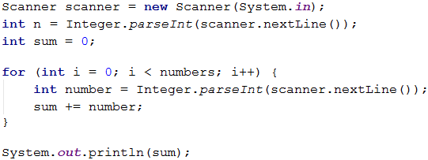

#### Тестване в Judge системата

Тествайте решението си тук: [https://judge.softuni.bg/Contests/Practice/Index/655#3](https://judge.softuni.bg/Contests/Practice/Index/655#3)

### Пример: най-голямо число

Да се напише програма, която въвежда **n цели числа** (**n** > 0) и намира **най-голямото** измежду тях. На първия ред на входа се въвежда броят числа **n**. След това се въвеждат самите числа, по едно на ред. Примери:

#### Примерен вход и изход

| Вход | Изход |
| --- | --- |
| 2 100 99 | 100 | 
| 3 -10 20 -30 | 20 |
| 4 45 -20 7 99  | 99 | 
| 1 999 | 999 |
| 2 -1 -2 | -1 |

#### Насоки и подсказки

Първо въвеждаме едно число **`n`** (броят числа, които предстои да бъдат въведени). Задаваме на текущия максимум **`max`** първоначална неутрална стойност, например **-10000000000000** (или **`Integer.MIN_VALUE`**). С помощта на **`for` цикъл**, чрез който итерираме **n-1 пъти**, прочитаме по едно цяло число **`num`**. Ако прочетеното число **`num`** е по-голямо от текущия максимум **`max`**, присвояваме стойността на **`num`** в променливата **`max`**. Накрая, в **`max`** трябва да се е запазило най-голямото число. Отпечатваме го на конзолата.

#### Тестване в Judge системата

Тествайте решението си тук: [https://judge.softuni.bg/Contests/Practice/Index/655#4](https://judge.softuni.bg/Contests/Practice/Index/655#4)

### Пример: най-малко число

Да се напише програма, която въвежда **n цели числа** (**n** > 0) и намира **най-малкото** измежду тях. Първо се въвежда броя числа **n**, след тях още **n** числа по едно на ред. 

#### Примерен вход и изход

| Вход | Изход | 
| --- | --- |
| 2 100 99 | 99 |
| 3 -10 20 -30 | -30 |
| 4 45 -20 7 99  | -20 |

#### Насоки и подсказки

Задачата е абсолютно аналогична с предходната:

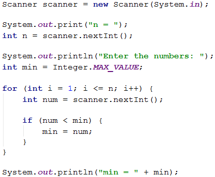

#### Тестване в Judge системата

Тествайте решението си тук: [https://judge.softuni.bg/Contests/Practice/Index/655#5](https://judge.softuni.bg/Contests/Practice/Index/655#5)

### Пример: лява и дясна сума

Да се напише програма, която въвежда **2 \* n цели числа** и проверява дали **сумата на първите n числа** (лява сума) е равна на **сумата на вторите n числа** (дясна сума). При равенство се печата **"Yes" + сумата**, иначе се печата **"No" + разликата**. Разликата се изчислява като положително число (по абсолютна стойност). 

#### Примерен вход и изход

| Вход | Изход | Вход | Изход |
| --- | --- | --- | --- | 
| 2 10 90 60 40 | Yes, sum = 100 | 2 90 9 50 50 | No, diff = 1 |

#### Насоки и подсказки

Първо въвеждаме числото **n**, след това първите **n** числа (**лявата** половина) и ги сумираме. Продължаваме с въвеждането на още **n** числа (**дясната** половина) и намираме и тяхната сума. Изчисляваме **разликата** между намерените суми по абсолютна стойност: **`Math.abs(leftSum - rightSum)`**. Ако разликата е **0**, отпечатваме **"Yes" + сумата**, в противен случай - отпечатваме **"No" + разликата**.

#### Тестване в Judge системата

Тествайте решението си тук: [https://judge.softuni.bg/Contests/Practice/Index/655#6](https://judge.softuni.bg/Contests/Practice/Index/655#6)

### Пример: четна / нечетна сума

Да се напише програма, която въвежда **n цели числа** и проверява дали **сумата на числата на четни позиции** е равна на **сумата на числата на нечетни позиции**. При равенство печата **"Yes" + сумата**, иначе печата **"No" + разликата**. Разликата се изчислява по абсолютна стойност. 

#### Примерен вход и изход

| Вход | Изход |
| --- | --- |
| 4 10 50 60 20 | Yes Sum = 70 |
| 4 3 5 1 -2 | No Diff = 1 |
| 3 5 8 1 | No Diff = 2 |

#### Насоки и подсказки

Въвеждаме числата едно по едно и изчисляваме двете **суми** (на числата на **четни** позиции и на числата на **нечетни** позиции). Както в предходната задача, изчисляваме абсолютната стойност на разликата и отпечатваме резултата (**"Yes" + сумата** при разлика 0 или **"No" + разликата** в противен случай).

**`+=`** е често използван **комбиниран оператор за присвояване**, добавя стойността на десния операнд към левия операнд и присвоява крайния резултат на левия операнд.
**C += A** е еквивалентно на **C = C + A**.

#### Тестване в Judge системата

Тествайте решението си тук: [https://judge.softuni.bg/Contests/Practice/Index/655#7](https://judge.softuni.bg/Contests/Practice/Index/655#7)

### Пример: сумиране на гласните букви

Да се напише програма, която въвежда **текст** (стринг), изчислява и отпечатва **сумата от стойностите на гласните букви** според таблицата по-долу:

| a | e | i | o | u | 
| :---: | :---: | :---: | :---: | :---: |
| 1 | 2 | 3 | 4 | 5 |

#### Примерен вход и изход

| Вход | Изход | Вход | Изход | 
| --- | --- | --- | --- |
| hello | 6 (e+o = 2+4 = 6) | bamboo | 9 (a+o+o = 1+4+4 = 9) |
| hi | 3 (i = 3) | beer | 4 (e+e = 2+2 = 4) |

#### Насоки и подсказки

Прочитаме входния текст **`s`**, зануляваме сумата и завъртаме цикъл от **0** до **`s.length() - 1`** (дължината на текста -1). Проверяваме всяка буква **`s.charAt(i)`** дали е гласна и съответно добавяме към сумата стойността ѝ.

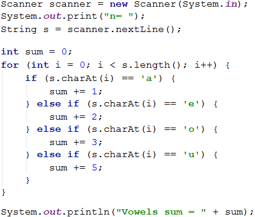

#### Тестване в Judge системата

Тествайте решението си тук: [https://judge.softuni.bg/Contests/Practice/Index/655#8](https://judge.softuni.bg/Contests/Practice/Index/655#8)

## Какво научихме от тази глава?

Можем да повтаряме блок код с **`for` цикъл**:

Можем да четем поредица от **`n`** числа от конзолата:

## Упражнения: повторения (цикли)

След като се запознахме с циклите, идва време **да затвърдим знанията си на практика**, а както знаете, това става с много писане на код. Да решим няколко задачи за упражнение.

### Създаване на нов проект в IntelliJ IDEA

Създаваме нов проект в IntelliJ IDEA, за да организираме по-добре решенията на задачите за упражнение, като за всяка задача трябва да създадем по един отделен клас.

Стартираме IntelliJ IDEA, избираме: **[Create New Project]**.

след това в лявото поле избираме Java, ако не сме посочили **PROJECT SDK: ** избираме пътя до инсталираната Java **JDK** директор след което натискаме **[Next]**.

На следващия прозорец отново избираме **[Next]**.

Наименуваме проекта (Project name:) **Loops** и избираме директория където да го запазим (Project location:).
След което натискаме **[Finish]**.

 
На следващият прозорец избираме **[OK]** за да създадем **Project location**, ако не сме създали предварително.

Така създадохме нов проект. Ако в левият прозорец натиснем триъгълника пред **Loops**, ще се отвори и самата структура на проекта.

За да създадем в нашият проект **пакет**, който да съдържа всички класове с решенията на задачите за упражнение, натискаме десен бутон на мишката върху **src**, избираме **New** -> **Package** и наименуваме пакета **tasks** (с малка първа буква).

За да създадем нов клас за първото упражнение, натискаме десен бутон на мишката върху **tasks**, избираме **New** -> **Java Class** и наименуваме класа **Task_01** (с главна първа буква).

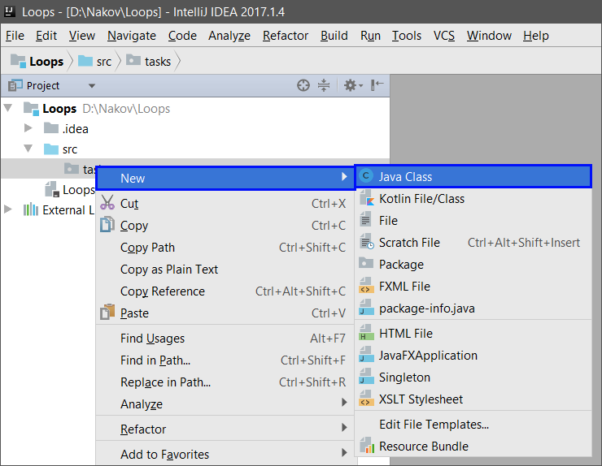

След тези промени структурата на проекта ще изглежда по следния начин:
 
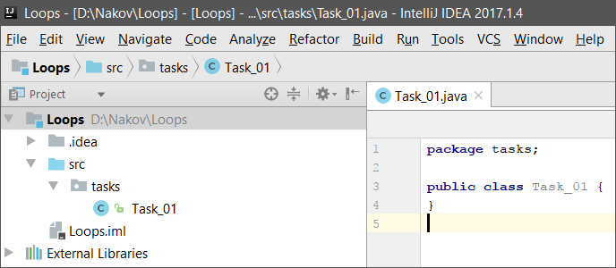
 
 Като за всяко следващо упражнение създадем нов клас, по описания по-горе начин за създаване на клас. 
 
### Задача: Елемент, равен на сумата на останалите

Да се напише програма, която въвежда **n цели числа** и проверява дали сред тях съществува число, което е равно на сумата на всички останали. Ако има такъв елемент, се отпечатва **"Yes" + неговата стойност**, в противен случай - **"No" + разликата между най-големия елемент и сумата на останалите** (по абсолютна стойност). 

#### Примерен вход и изход

| Вход | Изход | Коментар |
| --- | --- | :---: |
| 7 3 4 1 1 2 12 1 | Yes Sum = 12 | 3 + 4 + 1 + 2 + 1 + 1 = 12 |
| 4 6 1 2 3 | Yes Sum = 6 | 1 + 2 + 3 = 6 |
| 3 1 1 10 | No Diff = 8 | &#124;10 - (1 + 1)&#124; = 8 |
| 3 5 5 1 | No Diff = 1 | &#124;5 - (5 + 1)&#124; = 1 |
| 3 1 1 1 | No Diff = 1 | - |

#### Насоки и подсказки

Трябва да изчислим **сумата** на всички елементи, да намерим **най-големия** от тях и да проверим търсеното условие.

#### Тестване в Judge системата

Тествайте решението си тук: [https://judge.softuni.bg/Contests/Practice/Index/655#9](https://judge.softuni.bg/Contests/Practice/Index/655#9)

### Задача: четни / нечетни позиции

Напишете програма, която чете **n числа** и пресмята **сумата**, **минимума** и **максимума** на числата на **четни** и **нечетни** позиции (броим от 1). Когато няма минимален / максимален елемент, отпечатайте **"No"**. 

#### Примерен вход и изход

| Вход | Изход | Вход | Изход |
| --- | --- | --- | --- |
| 6 2 3 5 4 2 1 | OddSum=9, OddMin=2, OddMax=5, EvenSum=8, EvenMin=1, EvenMax=4 | 2 1.5 -2.5 | OddSum=1.5, OddMin=1.5, OddMax=1.5, EvenSum=-0.5, EvenMin=-2.5, EvenMax=2 |
| 1 1 | OddSum=1, OddMin=1, OddMax=1, EvenSum=0, EvenMin=No, EvenMax=No | 0 | OddSum=0, OddMin=No, OddMax=No, EvenSum=0, EvenMin=No, EvenMax=No |
| 5 3 -2 8 11 -3 | OddSum=8, OddMin=-3, OddMax=8, EvenSum=9, EvenMin=-2, EvenMax=11 | 4 1.5 1.75 1.5 1.75 | OddSum=3, OddMin=1.5, OddMax=1.5, EvenSum=3.5, EvenMin=1.75, EvenMax=1.75 |
| 1 -5 | OddSum=-5, OddMin=-5, OddMax=-5, EvenSum=0, EvenMin=No, EvenMax=No | 3 -1 -2 -3 | OddSum=-4, OddMin=-3, OddMax=-1, EvenSum=-2, EvenMin=-2, EvenMax=-2 |

#### Насоки и подсказки

Задачата обединява няколко предходни задачи: намиране на **минимум**, **максимум** и **сума**, както и обработка на елементите от **четни и нечетни позиции**. Припомнете си ги.

В тази задача е по-добре да се работи с **дробни числа** (не цели). Сумата, минимумът и максимумът също са дробни числа. Трябва да използваме **неутрална начална стойност** при намиране на минимум / максимум, например **1000000000.0** и **-1000000000.0**. Ако получим накрая неутралната стойност, печатаме **“No”**.

#### Тестване в Judge системата

Тествайте решението си тук: [https://judge.softuni.bg/Contests/Practice/Index/655#10](https://judge.softuni.bg/Contests/Practice/Index/655#10)

### Задача: еднакви двойки

Дадени са **2 \* n числа**. Първото и второто формират **двойка**, третото и четвъртото също и т.н. Всяка двойка има **стойност** – сумата от съставящите я числа. Напишете програма, която проверява **дали всички двойки имат еднаква стойност**. В случай, че е еднаква отпечатайте **"Yes, value=…" + стойността**, в противен случай отпечатайте **максималната разлика** между две последователни двойки в следния формат - **"No, maxdiff=…" + максималната разлика**. 

#### Примерен вход и изход

| Вход | Изход | Коментар |
| --- | --- | :---: | 
| 3 1 2 0 3 4 -1| Yes, value=3 | стойности = {3, 3, 3} еднакви стойности | 
| 2 1 2 2 2 | No, maxdiff=1 | стойности = {3, 4} разлики = {1} макс. разлика = 1 |
| 4 1 1 3 1 2 2 0 0 | No, maxdiff=4 | стойности = {2, 4, 4, 0} разлики = {2, 0, 4} макс. разлика = 4 |
| 1 5 5 | Yes, value=10 | стойности = {10} една стойност еднакви стойности |
| 2 -1 0 0 -1 | Yes, value=-1 | стойности = {-1, -1} еднакви стойности | 
| 2 -1 2 0 -1 | No, maxdiff=2 | стойности = {1, -1} разлики = {2} макс. разлика = 2 |

#### Насоки и подсказки

Прочитаме входните числа **по двойки**. За всяка двойка пресмятаме **сумата** ѝ. Докато четем входните двойки, за всяка двойка, без първата, трябва да пресметнем **разликата с предходната**. За целта е необходимо да пазим в отделна променлива сумата на предходната двойка. Накрая намираме **най-голямата разлика** между две двойки. Ако е **0**, печатаме **“Yes”** + стойността, в противен случай - **“No”** + разликата.

#### Тестване в Judge системата

Тествайте решението си тук: [https://judge.softuni.bg/Contests/Practice/Index/655#11](https://judge.softuni.bg/Contests/Practice/Index/655#11)

## Упражнения: графични и уеб приложения

В настоящата глава се запознахме с **циклите** като конструкция в програмирането, която ни позволява да повтаряме многократно дадено действие или група от действия. Сега нека си поиграем с тях. За целта ще начертаем няколко фигурки, които се състоят от голям брой повтарящи се графични елементи, но този път не на конзолата, а в графична среда, използвайки "**графика с костенурка**". Ще е интересно. И никак не е сложно. Опитайте!

### Задача: чертане с костенурка – графично GUI приложение

Целта на следващото упражнение е да си поиграем с една **библиотека за рисуване**, известна като **“графика с костенурка” (turtle graphics)**. Ще изградим графично приложение, в което ще **рисуваме различни фигури**, придвижвайки нашата **“костенурка”** по екрана чрез операции от типа “отиди напред 100 позиции”, “завърти се надясно на 30 градуса”, “отиди напред още 50 позиции”. Приложението ще изглежда приблизително така:

Нека първо се запознаем с **концепцията за рисуване “Turtle Graphics”**. Може да разгледаме следните източници:

* дефиниция на понятието “turtle graphics”: [http://c2.com/cgi/wiki?TurtleGraphics](http://c2.com/cgi/wiki?TurtleGraphics)
* статия за “turtle graphics” в Wikipedia – [https://en.wikipedia.org/wiki/Turtle_graphics](https://en.wikipedia.org/wiki/Turtle_graphics)
* интерактивен онлайн инструмент за чертане с костенурка – [https://blockly-games.appspot.com/turtle](https://blockly-games.appspot.com/turtle)

Започваме, като създаваме нов **Java проект** в **IntelliJ IDEA**. След това, добавяме нов пакет **app**. (описано по-рано в тази глава). 
Сваляме **MyTurtle.java** и **jturtle-0.1.1.jar** от [https://github.com/SoftUni/Programming-Basics-Book-Java-BG/tree/master/assets/chapter-5-1-assets](https://github.com/SoftUni/Programming-Basics-Book-Java-BG/tree/master/assets/chapter-5-1-assets). **MyTurtle.java** е предварително написан клас, който ще ни помогне по-бързо да се запознаем с библиотеката **jturtle-0.1.1.jar**, която управлява **костенурката**. Като използваме файл навигатор, копираме **MyTurtle.java** в директорията **app** на създадения проект. След това трябва да добавим външната библиотека **jturtle-0.1.1.jar** в нашия проект. Това става по следния начин:

* Избираме **File** от **File menu**.
* Натискаме **Project Structure** (CTRL + SHIFT + ALT + S).
* Натискаме **Select Modules** в левия панел.
* Натискаме **Dependencies tab**.
* Натискаме **'+'** → **JARs or directories**.

На следващият прозорец задаваме пътя до **jturtle-0.1.1.jar**, след това натискаме **ОК**.
 

На следващият прозорец маркираме само **classes check box**, след това натискаме **ОК**.
 

На следващият прозорец избираме **ОК** и сме готови да отворим **MyTurtle.java**.
  
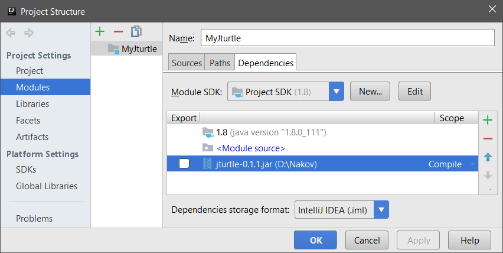

#### Основни Методи на класа Turtle

| Връщана   стойност | Метод и неговото описание |
| --- | --- |
| Turtle| **back**(double distance) - Same as bk(double distance). | 
| Turtle| **bk**(double distance) - Moves the Turtle backwards.|
| Turtle| **fd**(double distance) - Moves the Turtle forwards. |
| Turtle| **forward**(double distance) - Same as fd(double distance). |
| Turtle| **hideTurtle()** - Hides the turtle. |
| Turtle| **home()** - Move the Turtle back "home", i.e. set its position to the origin, facing NORTH. |
| Turtle| **ht()** - Hides the turtle. |
| Turtle| **left()** - Same as lt(double degrees)|
| Turtle| **lt()** - Turns the Turtle degrees degrees to the left.|
| Turtle| **pd()** - Lowers the Turtles Pen down so it will draw a line when moving. |
| Turtle| **penDown()** - Lowers the Turtles Pen down so it will draw a line when moving. |
| Turtle| **penUp()** - Lifts the Turtles Pen up so it won't draw a line anymore when moving. |
| Turtle| **penWidth**(int newWidth) - Set the pen width.|
| Turtle| **pu**(int newWidth) - Lifts the Turtles Pen up so it won't draw a line anymore when moving.|
| Turtle| **right**(double degrees) - Same as rt(double degrees).|
| Turtle| **rt**(double degrees) - Turns the Turtle degrees degrees to the right.|
| Turtle| **setColor**(Color color) - Set the turtle's color to the specified one.|
| Turtle| **setLineWidth**(double lineWidth) - Set the Line Thickness.|
| Turtle| **setPenColor**(Color color) - Set the Turtles Pen color.|
| Turtle| **setPos**(double x, double y) - Put the turtle to a new position with specified x- and y-coordinates.|
| Turtle| **showTurtle**() - The same as st().|
| Turtle| **speed**(double newSpeed) - Set the Turtles speed.|
| Turtle| **st**() - Sets the turtle to show mode.|

За да създадем метод който чертае триъгълник, в **MyTurtle.java** намираме празния метода **`drawTriangle()`** и написваме следния код: 

Този код мести и върти костенурката, която в началото е в центъра на екрана (в средата на формата), и чертае равностранен триъгълник. Може да го редактирате и да си поиграете с него.

**Стартираме** приложението с [**Shift + F10**]. Тестваме го дали работи (натискаме [**Draw**] бутона няколко пъти):

Сега може да променим и усложним кода на **костенурката**, като добавим следния код към нашия метод **`drawTriangle()`**: 

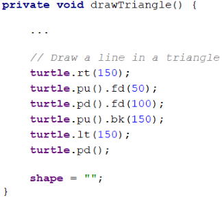

Отново **стартираме** приложението с [**Shift + F10**]. Тестваме дали работи новата програма за костенурката:

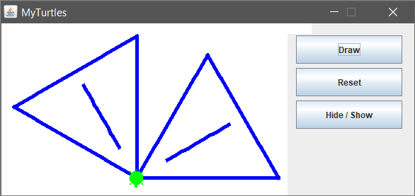

Вече нашата костенурката чертае по-сложни фигури.

Нека напишем кода и за останалите два бутона: целта на бутона [**Reset**] е да изтрие начертаната графика и да позиционира костенурката в нейната начална позиция, допълваме метода **`resetTurtle()`** със следния код:

Целта на бутона [**Hide / Show Turtle**] е да показва или скрива костенурката, допълваме метода **`showTurtle()`** със следния код:: 

Отново **стартираме** приложението с [**Shift + F10**] и тестваме, дали двата бутона работят коректно.

### Задача: * чертане на шестоъгълник с костенурката

Добавете бутон [**Hexagon**], който чертае правилен шестоъгълник:

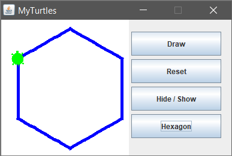

**Подсказка:**

В цикъл повторете 6 пъти следното:
* Ротация на 60 градуса.
* Движение напред 100.

### Добавяне на нов бутон за чертане на фигура

За добавяне нов бутон за чертане на нова фигура, може да проследим логиката в **MyTurtle.java** за бутона **Draw** и да създадем нов бутон за чертане на шестоъгълник **Hexagon**.

Първо добавяме новата фигура в **`enum Shape`**:

Създаваме нов бутон и му добавяме **`ActionListener`**, който присвоява на **`shape`** новата **`enum`** стойност:

След това добавяме новия бутон в **`bList`**:

Създаваме нов метод **`drawHex()`**, чрез който костенурката чертае шестоъгълник.
Задължително в края на метода **`shape = ""`**, този ред предотвратява многократното изпълнение на нашия метод!

В **`Thread t`** добавяме **`case "Hexagon`"**, който да извиква метода **`drawHex()`**:

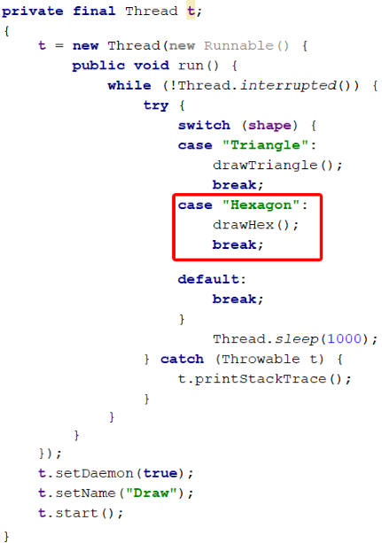

### Задача: * чертане на звезда с костенурката

Добавете бутон [**Star**], който чертае звезда с 5 върха (**петолъчка**), като на фигурата по-долу:

**Подсказка:**

Сменете цвета: **`turtle.setPenColor(Color.green);`**. 

В цикъл повторете 5 пъти следното:
* Движение напред 200.
* Ротация на 144 градуса.

### Задача: * чертане на спирала с костенурката

Добавете бутон [**Spiral**], който чертае спирала с 20 върха като на фигурата по-долу:

**Подсказка:**

Чертайте в цикъл, като движите напред и завъртате. С всяка стъпка увеличавайте постепенно дължината на движението напред и завъртайте на 60 градуса.

### Задача: * чертане на слънце с костенурката

Добавете бутон [**Sun**], който чертае слънце с 36 върха като на фигурата по-долу:

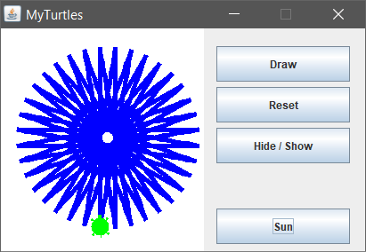

### Задача: * чертане на спирален триъгълник с костенурката

Добавете бутон [**Triangle**], който чертае три триъгълника с по 22 върха като на фигурата по-долу:

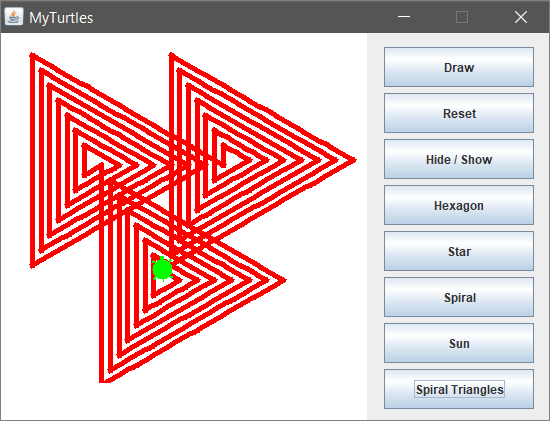

**Подсказка:**

Чертайте в цикъл като движите напред и завъртате. С всяка стъпка увеличавайте с 10 дължината на движението напред и завъртайте на 120 градуса. Повторете 3 пъти за трите триъгълника.

Ако имате проблеми с примерния проект по-горе попитайте във **форума на СофтУни**: https://softuni.bg/forum.

