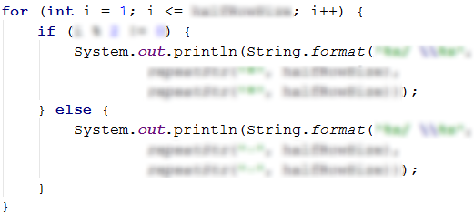
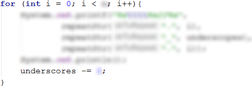
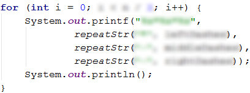

# Глава 6.2. Вложени цикли – изпитни задачи

В предходната глава разгледахме **вложените цикли** и как да ги използване за **рисуване** на различни **фигури на конзолата**. Научихме се как да отпечатваме фигури с различни размери, измисляйки подходяща логика на конструиране с използване на **единични и вложени `for`** цикли в комбинация с различни изчисления и програмна логика:

```java
for (int row = 1; row <= 5; row++) {
    System.out.print("*");
    for (int col = 1; col < 5; col++) {
        System.out.print(" *");
    }
    System.out.println();
}
```

Декларирахме си и собствен метод **`repeatStr(...)`**, който ни помага да печатаме **даден символ** (или поредица от символи) **определен** от нас брой пъти:


## Изпитни задачи

Сега нека решим заедно няколко изпитни задачи, за да затвърдим наученото и да развием още алгоритмичното си мислене.

### Задача: чертане на крепост

Да се напише програма, която прочита от конзолата **цяло число n** и чертае **крепост** с ширина **2 * n колони** и височина **n реда** като в примерите по-долу. Лявата и дясната колона във вътрешността си са широки **n / 2**.

#### Входни данни

Входът е **цяло число n** в интервала [**3…1000**].

#### Изходни данни

Да се отпечатат на конзолата **n** текстови реда, изобразяващи **крепостта**, точно както в примерите.

#### Примерен вход и изход

|Вход|Изход|Вход|Изход|
|----|----|----|----|
|3|<code>&#47;&#94;&#92;&#47;&#94;&#92;</code><br><code>&#124;&nbsp;&nbsp;&nbsp;&nbsp;&#124;</code><br><code>&#92;&#95;&#47;&#92;&#95;&#47;</code>|4|<code>&#47;&#94;&#94;&#92;&#47;&#94;&#94;&#92;</code><br><code>&#124;&nbsp;&nbsp;&nbsp;&nbsp;&nbsp;&nbsp;&#124;</code><br><code>&#124;&nbsp;&nbsp;&nbsp;&nbsp;&nbsp;&nbsp;&#124;</code><br><code>&#92;&#95;&#95;&#47;&#92;&#95;&#95;&#47;</code><br>|

|Вход|Изход|Вход|Изход|
|----|----|----|----|
|5|<code>&#47;&#94;&#94;&#92;&#95;&#95;&#47;&#94;&#94;&#92;</code><br><code>&#124;&nbsp;&nbsp;&nbsp;&nbsp;&nbsp;&nbsp;&nbsp;&nbsp;&#124;</code><br><code>&#124;&nbsp;&nbsp;&nbsp;&nbsp;&nbsp;&nbsp;&nbsp;&nbsp;&#124;</code><br><code>&#124;&nbsp;&nbsp;&nbsp;&#95;&#95;&nbsp;&nbsp;&nbsp;&#124;</code><br><code>&#92;&#95;&#95;&#47;&nbsp;&nbsp;&#92;&#95;&#95;&#47;</code><br>|8|<code>&#47;&#94;&#94;&#94;&#94;&#92;&#95;&#95;&#95;&#95;&#47;&#94;&#94;&#94;&#94;&#92;</code><br><code>&#124;&nbsp;&nbsp;&nbsp;&nbsp;&nbsp;&nbsp;&nbsp;&nbsp;&nbsp;&nbsp;&nbsp;&nbsp;&nbsp;&nbsp;&#124;</code><br><code>&#124;&nbsp;&nbsp;&nbsp;&nbsp;&nbsp;&nbsp;&nbsp;&nbsp;&nbsp;&nbsp;&nbsp;&nbsp;&nbsp;&nbsp;&#124;</code><br><code>&#124;&nbsp;&nbsp;&nbsp;&nbsp;&nbsp;&nbsp;&nbsp;&nbsp;&nbsp;&nbsp;&nbsp;&nbsp;&nbsp;&nbsp;&#124;</code><br><code>&#124;&nbsp;&nbsp;&nbsp;&nbsp;&nbsp;&nbsp;&nbsp;&nbsp;&nbsp;&nbsp;&nbsp;&nbsp;&nbsp;&nbsp;&#124;</code><br><code>&#124;&nbsp;&nbsp;&nbsp;&nbsp;&nbsp;&nbsp;&nbsp;&nbsp;&nbsp;&nbsp;&nbsp;&nbsp;&nbsp;&nbsp;&#124;</code><br><code>&#124;&nbsp;&nbsp;&nbsp;&nbsp;&nbsp;&#95;&#95;&#95;&#95;&nbsp;&nbsp;&nbsp;&nbsp;&nbsp;&#124;</code><br><code>&#92;&#95;&#95;&#95;&#95;&#47;&nbsp;&nbsp;&nbsp;&nbsp;&#92;&#95;&#95;&#95;&#95;&#47;</code><br>|

#### Насоки и подсказки

От условието на задачата виждаме, че **входните данни** ще бъдат прочетени само от един ред, който ще съдържа в себе си едно **цяло число** в интервала [**3...1000**]. По тази причина ще използваме **променлива** от тип **`int`**.


След като вече сме декларирали и инициализирали входните данни, трябва да разделим **крепостта** на три части:
* покрив
* тяло
* основа

От примерите можем да разберем, че **покривът** е съставен от **две кули** и **междинна част**. Всяка кула се състои от начало **`/`**, среда **`^`** и край **`\`**.

<table><tr><td></td>
<td><strong><code>\</code></strong> е специален символ в езика Java и използвайки само него в метода <strong><code>System.out.println(...)</code></strong>, конзолата няма да го разпечата, затова с <strong><code>\\</code></strong> показваме на конзолата, че този оператор в случая е обикновен символ.</td>
</tr></table>

Средата е с размер, равен на **`n / 2`**, следователно можем да отделим тази стойност в отделна **променлива**. Тя ще пази **големината** на **средата на кулата**.


Декларираме си и втора **променлива**, в която ще пазим **стойността** на частта **между двете кули**. Междинната част на покрива е с размер  **`2 * n - 2 * colSize - 4`**.


За да изпечатаме на конзолата **покрива**, ще използваме нашия метод **`repeatStr(...)`**, който приема два параметъра **`(string, int)`** и съединява даден символ (или поредица от символи) **n** на брой пъти.


**Тялото на крепостта** се състои от начало **`|`**, среда **`(празно място)`** и край **`|`**. **Средата** от празно място е с големина **`2 * n - 2`**. Броят на **редовете** за стени, можем да определим от дадените ни примери - **`n - 3`**.


За да нарисуваме предпоследния ред, който е част от основата, трябва да изпечатаме начало **`|`**, среда **`(празно място)_(празно място)`** и край **`|`**. За да направим това, можем да използваме отново вече декларираните от нас променливи **`colSize`** и **`midSize`**, защото от примерите виждаме, че са равни на броя **`_`** в покрива.


Добавяме към стойността на **празните места** **`+ 1`**, защото в примерите имаме **едно** празно място повече.

Структурата на **основата на крепостта** е еднаква с тази на **покрива**. Съставена е от **две кули** и **междинна част**. Всяка една **кула** има начало **`\`**, среда **`_`** и край **`/`**.


#### Тестване в Judge системата

Тествайте решението си тук: [https://judge.softuni.bg/Contests/Practice/Index/658#0](https://judge.softuni.bg/Contests/Practice/Index/658#0).


### Задача: пеперуда

Да се напише програма, която прочита от конзолата **цяло число n** и чертае **пеперуда** с ширина **2 * n - 1 колони** и височина **2 * (n - 2) + 1 реда** като в примерите по-долу.  **Лявата и дясната** ѝ **част** са **широки n - 1**.

#### Входни данни

Входът е **цяло число n** в интервала [**3…1000**].

#### Изходни данни

Да се отпечатат на конзолата **2 * (n - 2) + 1**  текстови реда, изобразяващи **пеперудата**, точно както в примерите.

#### Примерен вход и изход

|Вход|Изход|Вход|Изход|
|---|---|---|---|
|3|<code>&#42;&#92;&nbsp;&#47;&#42;</code><br><code>&nbsp;&nbsp;&#64;&nbsp;&nbsp;</code><br><code>&#42;&#47;&nbsp;&#92;&#42;</code><br>|5|<code>&#42;&#42;&#42;&#92;&nbsp;&#47;&#42;&#42;&#42;</code><br><code>&#45;&#45;&#45;&#92;&nbsp;&#47;&#45;&#45;&#45;</code><br><code>&#42;&#42;&#42;&#92;&nbsp;&#47;&#42;&#42;&#42;</code><br><code>&nbsp;&nbsp;&nbsp;&nbsp;&#64;&nbsp;&nbsp;&nbsp;&nbsp;</code><br><code>&#42;&#42;&#42;&#47;&nbsp;&#92;&#42;&#42;&#42;</code><br><code>&#45;&#45;&#45;&#47;&nbsp;&#92;&#45;&#45;&#45;</code><br><code>&#42;&#42;&#42;&#47;&nbsp;&#92;&#42;&#42;&#42;</code><br>|

|Вход|Изход|
|---|---|
|7|<code>&#42;&#42;&#42;&#42;&#42;&#92;&nbsp;&#47;&#42;&#42;&#42;&#42;&#42;</code><br><code>&#45;&#45;&#45;&#45;&#45;&#92;&nbsp;&#47;&#45;&#45;&#45;&#45;&#45;</code><br><code>&#42;&#42;&#42;&#42;&#42;&#92;&nbsp;&#47;&#42;&#42;&#42;&#42;&#42;</code><br><code>&#45;&#45;&#45;&#45;&#45;&#92;&nbsp;&#47;&#45;&#45;&#45;&#45;&#45;</code><br><code>&#42;&#42;&#42;&#42;&#42;&#92;&nbsp;&#47;&#42;&#42;&#42;&#42;&#42;</code><br><code>&nbsp;&nbsp;&nbsp;&nbsp;&nbsp;&nbsp;&#64;&nbsp;&nbsp;&nbsp;&nbsp;&nbsp;&nbsp;</code><br><code>&#42;&#42;&#42;&#42;&#42;&#47;&nbsp;&#92;&#42;&#42;&#42;&#42;&#42;</code><br><code>&#45;&#45;&#45;&#45;&#45;&#47;&nbsp;&#92;&#45;&#45;&#45;&#45;&#45;</code><br><code>&#42;&#42;&#42;&#42;&#42;&#47;&nbsp;&#92;&#42;&#42;&#42;&#42;&#42;</code><br><code>&#45;&#45;&#45;&#45;&#45;&#47;&nbsp;&#92;&#45;&#45;&#45;&#45;&#45;</code><br><code>&#42;&#42;&#42;&#42;&#42;&#47;&nbsp;&#92;&#42;&#42;&#42;&#42;&#42;</code><br>|

#### Насоки и подсказки

От условието на задачата виждаме, че **входните данни** ще бъдат прочетени само от един ред, който ще съдържа в себе си едно **цяло число** в интервала [**3...1000**]. По тази причина ще използваме **променлива** от тип **`int`**.


Можем да разделим фигурата на 3 части - **горно крило**, **тяло** и **долно крило**. За да начертаем горното крило на пеперудата, трябва да го разделим на части - начало **`*`**, среда **`\ /`** и край **`*`**. След разглеждане на примерите можем да кажем, че началото е с големина **`n - 2`**.


Виждаме също така, че горното крило на пеперудата е с размер **`n - 2`**, затова можем да направим цикъл, който да се повтаря **`halfRowSize`** пъти.


От примерите можем да забележим, че на **четен** ред имаме начало **`*`**, среда **`\ /`** и край **`*`**, а на **нечетен** - начало **`-`**, среда **`\ /`** и край **`-`**. Следователно, трябва да направим **`if-else`** проверка дали е четен или нечетен редът и съответно да изпечатаме един от двата типа редове.


За да направим **тялото на пеперудата**, можем отново да използваме **променливата** **`halfRowSize`** и да отпечатаме на конзолата точно **един** ред. Структурата на тялото е с начало **`(празно място)`**, среда **`@`** и край **`(празно място)`**.


Остава да изпечатаме на конзолата и долното крило, което е идентично с горното крило.



#### Тестване в Judge системата

Тествайте решението си тук: [https://judge.softuni.bg/Contests/Practice/Index/658#1](https://judge.softuni.bg/Contests/Practice/Index/658#1).


### Задача: знак "Стоп"

Да се напише програма, която прочита от конзолата **цяло число n** и чертае **предупредителен знак STOP** с размери като в примерите по-долу.

#### Входни данни

Входът е **цяло число N** в интервала [**3…1000**].

#### Изходни данни

Да се отпечатат на конзолата текстови редове, изобразяващи **предупредителния знак STOP**, точно както в примерите.

#### Примерен вход и изход

|Вход|Изход|Вход|Изход|
|----|----|----|----|
|3|<code>....\_\_\_\_\_\_\_....</code><br><code>...//\_\_\_\_\_\\\\...</code><br><code>..//\_\_\_\_\_\_\_\\\\..</code><br><code>.//\_\_\_\_\_\_\_\_\_\\\\.</code><br><code>//\_\_\_STOP!\_\_\_\\\\</code><br><code>\\\\\_\_\_\_\_\_\_\_\_\_\_//</code><br><code>.\\\\\_\_\_\_\_\_\_\_\_//.</code><br><code>..\\\\\_\_\_\_\_\_\_//..</code><br>|6|<code>.......\_\_\_\_\_\_\_\_\_\_\_\_\_.......</code><br><code>......//\_\_\_\_\_\_\_\_\_\_\_\\\\......</code><br><code>.....//\_\_\_\_\_\_\_\_\_\_\_\_\_\\\\.....</code><br><code>....//\_\_\_\_\_\_\_\_\_\_\_\_\_\_\_\\\\....</code><br><code>...//\_\_\_\_\_\_\_\_\_\_\_\_\_\_\_\_\_\\\\...</code><br><code>..//\_\_\_\_\_\_\_\_\_\_\_\_\_\_\_\_\_\_\_\\\\..</code><br><code>.//\_\_\_\_\_\_\_\_\_\_\_\_\_\_\_\_\_\_\_\_\_\\\\.</code><br><code>//\_\_\_\_\_\_\_\_\_STOP!\_\_\_\_\_\_\_\_\_\\\\</code><br><code>\\\\\_\_\_\_\_\_\_\_\_\_\_\_\_\_\_\_\_\_\_\_\_\_\_//</code><br><code>.\\\\\_\_\_\_\_\_\_\_\_\_\_\_\_\_\_\_\_\_\_\_\_//.</code><br><code>..\\\\\_\_\_\_\_\_\_\_\_\_\_\_\_\_\_\_\_\_\_//..</code><br><code>...\\\\\_\_\_\_\_\_\_\_\_\_\_\_\_\_\_\_\_//...</code><br><code>....\\\\\_\_\_\_\_\_\_\_\_\_\_\_\_\_\_//....</code><br><code>.....\\\\_\_\_\_\_\_\_\_\_\_\_\_\_//.....</code><br>|

|Вход|Изход|
|---|---|
|7|<code>........\_\_\_\_\_\_\_\_\_\_\_\_\_\_\_........</code><br><code>.......//\_\_\_\_\_\_\_\_\_\_\_\_\_\\\\.......</code><br><code>......//\_\_\_\_\_\_\_\_\_\_\_\_\_\_\_\\\\......</code><br><code>.....//\_\_\_\_\_\_\_\_\_\_\_\_\_\_\_\_\_\\\\.....</code><br><code>....//\_\_\_\_\_\_\_\_\_\_\_\_\_\_\_\_\_\_\_\\\\....</code><br><code>...//\_\_\_\_\_\_\_\_\_\_\_\_\_\_\_\_\_\_\_\_\_\\\\...</code><br><code>..//\_\_\_\_\_\_\_\_\_\_\_\_\_\_\_\_\_\_\_\_\_\_\_\\\\..</code><br><code>.//\_\_\_\_\_\_\_\_\_\_\_\_\_\_\_\_\_\_\_\_\_\_\_\_\_\\\\.</code><br><code>//\_\_\_\_\_\_\_\_\_\_\_STOP!\_\_\_\_\_\_\_\_\_\_\_\\\\</code><br><code>\\\\\_\_\_\_\_\_\_\_\_\_\_\_\_\_\_\_\_\_\_\_\_\_\_\_\_\_\_//</code><br><code>.\\\\\_\_\_\_\_\_\_\_\_\_\_\_\_\_\_\_\_\_\_\_\_\_\_\_\_//.</code><br><code>..\\\\\_\_\_\_\_\_\_\_\_\_\_\_\_\_\_\_\_\_\_\_\_\_\_//..</code><br><code>...\\\\\_\_\_\_\_\_\_\_\_\_\_\_\_\_\_\_\_\_\_\_\_//...</code><br><code>....\\\\\_\_\_\_\_\_\_\_\_\_\_\_\_\_\_\_\_\_\_//....</code><br><code>.....\\\\\_\_\_\_\_\_\_\_\_\_\_\_\_\_\_\_\_//.....</code><br><code>......\\\\\_\_\_\_\_\_\_\_\_\_\_\_\_\_\_//......</code><br>|

#### Насоки и подсказки

От условието на задачата виждаме, че **входните данни** ще бъдат прочетени само от един ред, който ще съдържа в себе си едно **цяло число** в интервала [**3...1000**]. По тази причина ще използваме **променлива** от тип **`int`**.


Можем да **разделим** фигурата на **3 части** - горна, средна и долна. **Горната част** се състои от две подчасти - начален ред и редове, в които знака се разширява. **Началния ред** е съставен от начало **`.`**, среда **`_`** и край **`.`**. След разглеждане на примерите можем да кажем, че началото е с големина **`n + 1`** и е добре да отделим тази **стойност** в отделна **променлива**.


		
Трябва да създадем и втора **променлива**, в която ще пазим **стойността** на **средата на началния ред** и е с големина **`2 * n + 1`**.


		
След като вече сме декларирали и инициализирали двете променливи, можем да изпечатаме на конзолата началния ред. Нека не забравяме преминаването на нов ред на конзолата със **`System.out.println(...)`**.


		
За да начертаем редовете, в които знака се **"разширява"**, трябва да създадем **цикъл**, който да се завърти **`n`** брой пъти. Структурата на един ред се състои от начало **`.`**, **`//`** + среда **`_`** + **`\\`** и край **`.`**. За да можем да използваме отново създадените **променливи**, трябва да намалим **`dots`** с 1 и **`underscopes`** с 2, защото ние вече сме **изпечатали** първия ред, а точките и долните черти в горната част от фигурата на всеки ред **намаляват**. 


		
На всяка следваща итерация **началото** и **краят** намаляват с 1, а **средата** се увеличава с 2.


		
**Средната част** от фигурата има начало **`//`** + **`_`**, среда **`STOP!`** и край **`_`** + **`\\`**. Броят на долните черти **`_`** е **`(underscopes - 5) / 2`**.


		
**Долната част** на фигурата, в която знакът се **смалява**, можем да направим като отново създадем **цикъл**, който да се завърти **`n`** брой пъти. Структурата на един ред е начало **`.`** + **`\\`**, среда **`_`** и край **`//`** + **`.`**. Броят на **точките** при първата итерация на цикъла трябва да е 0 и на всяка следваща да се **увеличава** с едно. Следователно можем да кажем, че големината на **точките в долната част от фигурата** е равна на **`i`**.


		
За да работи нашата програма правилно, трябва на всяка итерация от **цикъла** да **намаляваме** броя на **`_`** с 2.



#### Тестване в Judge системата

Тествайте решението си тук: [https://judge.softuni.bg/Contests/Practice/Index/658#2](https://judge.softuni.bg/Contests/Practice/Index/658#2).


### Задача: стрелка
Да се напише програма, която прочита от конзолата **цяло нечетно число n** и чертае **вертикална стрелка** с размери като в примерите по-долу.

#### Входни данни
Входът е **цяло нечетно число n** в интервала [**3…79**].

#### Изходни данни
Да се отпечата на конзолата вертикална стрелка, при която **"#"(диез)** индикира стрелката, а **"."** - останалото.

#### Примерен вход и изход

|Вход|Изход|Вход|Изход|
|----|----|----|----|
|3|<code>.###.</code><br><code>.#.#.</code><br><code>##.##</code><br><code>.#.#.</code><br><code>..#..</code><br>|5|<code>..#####..</code><br><code>..#...#..</code><br><code>..#...#..</code><br><code>..#...#..</code><br><code>###...###</code><br><code>.#.....#.</code><br><code>..#...#..</code><br><code>...#.#...</code><br><code>....#....</code><br>|

|Вход|Изход|
|---|---|
|9|<code>....#########....</code><br><code>....#.......#....</code><br><code>....#.......#....</code><br><code>....#.......#....</code><br><code>....#.......#....</code><br><code>....#.......#....</code><br><code>....#.......#....</code><br><code>....#.......#....</code><br><code>#####.......#####</code><br><code>.#.............#.</code><br><code>..#...........#..</code><br><code>...#.........#...</code><br><code>....#.......#....</code><br><code>.....#.....#.....</code><br><code>......#...#......</code><br><code>.......#.#.......</code><br><code>........#........</code><br>|

#### Насоки и подсказки

От условието на задачата виждаме, че **входните данни** ще бъдат прочетени само от един ред, който ще съдържа в себе си едно **цяло число** в интервала [**3...1000**]. По тази причина ще използваме **променлива** от тип **`int`**.


		
Можем да разделим фигурата на **3 части** - горна, средна и долна. **Горната част** се състои от две подчасти - начален ред и тяло на стрелката. От примерите виждаме, че броят на **външните точки** в началния ред и в тялото на стрелката са **`(n - 1) / 2`**. Тази стойност можем да запишем в **променлива** **`outerDots`**. 


		
Броят на **вътрешните точки** в тялото на стрелката е **`(n - 2)`**. Трябва да създадем **променлива** с име **`innerDots`**, която  ще пази тази стойност.


		
От примерите можем да видим структурата на началния ред. Трябва да използваме декларираните и инициализирани от нас **променливи** **`outerDots`** и **`n`**, за да изпечатаме **началния ред**. Не трябва да забравяме, че трябва да отидем на нов ред със **`System.out.println();`**.


За да нарисуваме на конзолата **тялото на стрелката**, трябва да създадем **цикъл**, който да се повтори **`n - 2`** пъти.


**Средата на фигурата** е съставена от начало **`#`**, среда **`.`** и край **`#`**. От примерите виждаме, че броят на **`#`** е равен на **`outerDots`**, увеличен с 1 и за това можем да използваме отново същата **променлива**.


За да начертаем **долната част на стрелката**, трябва да зададем нови стойности на двете **променливи** **`outerDots`** и **`innerDots`**.


**Цикъла**,  който ще направим, трябва да се завърти **`n - 2`** пъти и отделно ще изпечатаме последния ред от фигурата. На всяка итерация **`outerDots`** се увеличава с 1, а **`innerDots`** намалява с 2.


		
**Последният ред** от нашата фигура е съставен от начало **`.`**, среда **`#`** и край **`.`**. Броят на **`.`** е равен на **`outerDots`**.
   


#### Тестване в Judge системата

Тествайте решението си тук: [https://judge.softuni.bg/Contests/Practice/Index/658#3](https://judge.softuni.bg/Contests/Practice/Index/658#3).


### Задача: брадва

Да се напише програма, която прочита **цяло число n** и чертае брадва с размери, показани по-долу.
Ширината на брадвата е **`5 * N`**  колони.


#### Входни данни

Входът е **цяло число n** в интервала [**2..42**].

#### Изходни данни

Да се отпечата на конзолата **брадва**, точно както е в примерите.

#### Примерен вход и изход

|Вход|Изход|Вход|Изход|
|---|---|---|---|
|2|<code>------\*\*--</code><br><code>------\*-\*-</code><br><code>\*\*\*\*\*\*\*-\*-</code><br><code>------\*\*\*-</code><br>|5|<code>---------------\*\*--------</code><br><code>---------------\*-\*-------</code><br><code>---------------\*--\*------</code><br><code>---------------\*---\*-----</code><br><code>---------------\*----\*----</code><br><code>\*\*\*\*\*\*\*\*\*\*\*\*\*\*\*\*----\*----</code><br><code>\*\*\*\*\*\*\*\*\*\*\*\*\*\*\*\*----\*----</code><br><code>---------------\*----\*----</code><br><code>--------------\*\*\*\*\*\*\*\*---</code><br>|

|Вход|Изход|
|---|---|
|8|<code>------------------------\*\*--------------</code><br><code>------------------------\*-\*-------------</code><br><code>------------------------\*--\*------------</code><br><code>------------------------\*---\*-----------</code><br><code>------------------------\*----\*----------</code><br><code>------------------------\*-----\*---------</code><br><code>------------------------\*------\*--------</code><br><code>------------------------\*-------\*-------</code><br><code>\*\*\*\*\*\*\*\*\*\*\*\*\*\*\*\*\*\*\*\*\*\*\*\*\*-------\*-------</code><br><code>\*\*\*\*\*\*\*\*\*\*\*\*\*\*\*\*\*\*\*\*\*\*\*\*\*-------\*-------</code><br><code>\*\*\*\*\*\*\*\*\*\*\*\*\*\*\*\*\*\*\*\*\*\*\*\*\*-------\*-------</code><br><code>\*\*\*\*\*\*\*\*\*\*\*\*\*\*\*\*\*\*\*\*\*\*\*\*\*-------\*-------</code><br><code>------------------------\*-------\*-------</code><br><code>-----------------------\*---------\*------</code><br><code>----------------------\*-----------\*-----</code><br><code>---------------------\*\*\*\*\*\*\*\*\*\*\*\*\*\*\*----</code><br>|

#### Насоки и подсказки

За решението на задачата е нужно първо да изчислим големината на **тиретата от ляво**, **средните тирета**, **тиретата от дясно** и цялата дължина на фигурата.


След като сме декларирали и инициализирали **променливите**, можем да започнем да изчертаваме фигурата като започнем с **горната част**. От примерите можем да разберем каква е структурата на **първия ред** и да създадем цикъл, който се повтаря **`n`** брой пъти. На всяка итерация от цикъла **средните тирета** се увеличават с 1, а **тиретата от дясно** се намаляват с 1.


За да можем да използваме отново създадените **променливи** при чертането на дръжката на брадвата, трябва да намалим **средните тирета** с 1,а **тиретата от дясно** да увеличим с 1.


**Дръжката на брадвата** можем да нарисуваме, като завъртим цикъл, който се повтаря **`n - 2`** пъти. От примерите можем да разберем, каква е нейната структура.



**Долната част** на фигурата, трябва да разделим на две подчасти - **глава на брадвата** и **последния ред от фигурата**. **Главата на брадвата** ще изпечатаме на конзолата, като направим цикъл, който да се повтаря **`n / 2 - 1`** пъти. На всяка итерация **тиретата от ляво** и **тиретата от дясно** намаляват с 1, а **средните тирета** се увеличават с 2.


За **последният ред** от фигурата, можем отново да използваме трите, вече декларирани и инициализирани променливи **`leftDashes`**, **`middleDashes`**, **`rightDashes`**.


#### Тестване в Judge системата

Тествайте решението си тук: [https://judge.softuni.bg/Contests/Practice/Index/658#4](https://judge.softuni.bg/Contests/Practice/Index/658#4).
