# Глава 7.1. По-сложни цикли

След като научихме какво **представляват** и за какво служат **по-простите** цикли, сега **предстои** да се запознаем с **по-сложни** такива. Те ще **разширят познанията** ни и ще ни **помагат** в решаването на **по-трудни** и предизвикателни задачи. Видовете, които ще разгледаме, са: 

  * Цикли **със стъпка**.
  * **`While`** цикли.
  * **`Do-while`** цикли.
  * **Безкрайни** цикли.

В настоящата тема ще разберем и какво представлява операторът **`break`**, както и **как** чрез него да **прекъснем** един цикъл. Също така, използвайки **`try-catch`** конструкцията, ще се научим да следим за **грешки** по време на изпълнението на програмата ни. 


## Видео

<div class="video-player">
  Гледайте видео-урок по тази глава тук: <a target="_blank"
  href="https://www.youtube.com/watch?v=kaJSrGrvakQ">
  https://www.youtube.com/watch?v=kaJSrGrvakQ</a>.
</div>
<script src="/assets/js/video.js"></script>


## Цикли със стъпка

В главата **"Повторения (цикли)"** научихме как работи **`for`** цикълът и вече знаем кога и с каква цел да го използваме. В тази тема ще обърнем **внимание** на една определена и много важна **част от конструкцията** му, а именно **стъпката**.  

### Какво представлява стъпката?

**Стъпката** е тази **част** от конструкцията на **`for`** цикъла, която указва с **колко** да се **увеличи** или **намали** стойността на **водещата** му променлива. Тя се декларира последна в скелета на **`for`** цикъла.

Най-често е с **размер `1`** и в такъв случай, вместо да пишем **`i += 1`** или **`i -= 1`**, можем да използваме операторите 
**`i++`** или **`i--`**. Ако искаме стъпката ни да е **различна от 1**, при увеличение използваме оператора **`i += (размера на стъпката)`**, а при намаляване **`i -= (размера на стъпката)`**. При стъпка 10, цикълът би изглеждал по следния начин: 


Следва поредица от примерни задачи, решението на които ще ни помогне да разберем по-добре употребата на **стъпката** във **`for`** цикъл.

### Пример: числата от 1 до N през 3

Да се напише програма, която отпечатва числата **от 1 до n** със **стъпка 3**. Например, **ако n = 100**, то резултатът ще е: **1, 4, 7, 10, …, 94, 97, 100**.

Нека видим какви са нужните стъпки, за да може нашата програма да се изпълни коректно:

  * Вземаме числото **`n`** от входа на конзолата.
  * Създаваме **`for` цикъл** с размер на стъпката 3.
  * В **тялото на цикъла** отпечатваме стойността на текущата стъпка.
  


#### Тестване в Judge системата

Тествайте решението си тук: [https://judge.softuni.bg/Contests/Practice/Index/659#0](https://judge.softuni.bg/Contests/Practice/Index/659#0)

### Пример: числата от N до 1 в обратен ред

Да се напише програма, която отпечатва числата **от n до 1 в обратен ред** (стъпка -1). Например, **ако n = 100**, то резултатът ще е: **100, 99, 98, …, 3, 2, 1**.

Да погледнем нужните стъпки за коректното изпълнение на нашата програма:

  * Вземаме числото **`n`** от входа на конзолата.
  * Създаваме **`for` цикъл**, като присвояваме **`int i = n`** .
  * Обръщаме условието на цикъла: **`i >= 1`**.
  * Дефинираме размера на стъпката: -1.
  * В **тялото на цикъла** отпечатваме стойността на текущата стъпка.


#### Тестване в Judge системата

Тествайте решението си тук: [https://judge.softuni.bg/Contests/Practice/Index/659#1](https://judge.softuni.bg/Contests/Practice/Index/659#1)

### Пример: числата от 1 до 2^n с for цикъл

В следващия пример ще разгледаме ползването на обичайната стъпка с размер 1.

Да се напише програма, която отпечатва числата **от 1 до 2^n** (две на степен n). Например, **ако n = 10**, то резултатът ще е **1, 2, 4, 8, 16, 32, 64, 128, 256, 512, 1024**.


#### Тестване в Judge системата

Тествайте решението си тук: [https://judge.softuni.bg/Contests/Practice/Index/659#2](https://judge.softuni.bg/Contests/Practice/Index/659#2)

### Пример: четни степени на 2

Да се отпечатат **четните** степени на **2** до **2^n**: **2^0, 2^2, 2^4, 2^8, …, 2^n**. Например, ако **n = 10**, то резултатът ще е **1, 4, 16, 64, 256, 1024**.

Ето какви са нужните **стъпки**, за да може нашата програма да се изпълни коректно:

  * Създаваме променлива **`num`** за текущото число, на която присвояваме начална **стойност 1**.
  * За **стъпка** на цикъла слагаме стойност **2**.
  * В **тялото на цикъла**: oтпечатваме стойността на текущото число и увеличаваме текущото число според условието на задачата.


#### Тестване в Judge системата

Тествайте решението си тук: [https://judge.softuni.bg/Contests/Practice/Index/659#3](https://judge.softuni.bg/Contests/Practice/Index/659#3)

## While цикъл

Следващият цикъл, с който ще се запознаем, се нарича **`while`**. Специфичното при него е, че **продължава изпълнението си**, докато дадено условие е **истина**. Като структура се различава от тази на **`for`** цикъла, но е също толкова ефикасен и **нужен**.

### Какво представлява while цикълът?

**`While`** цикълът се използва, когато искаме да **повтаряме** извършването на определена логика, докато **е в сила** дадено условие. Под "**условие**", разбираме всеки **израз**, който връща **`true`** или **`false`**. Когато **условието** стане **грешно**, **`while`** цикълът **прекъсва** изпълнението си и програмата **продължава** с реализацията на **останалия** код. Конструкцията на цикъла изглежда по този начин:


Следва поредица от примерни задачи, решението на които ще ни помогне да разберем по-добре употребата на **`while`** цикъла.

### Пример: редица числа 2k+1

Да се напише програма, която отпечатва всички **числа ≤ n** от редицата: **1, 3, 7, 15, 31**..., като приемем, че всяко следващо число = **предишно число \* 2 + 1**

Нека видим какви са нужните **стъпки**, за да може нашата програма да се изпълни коректно:

* Създаваме променлива **`num`** за текущото число, на която присвояваме начална **стойност 1**.
* За условие на цикъла слагаме **текущото число <= n**.
* В **тялото на цикъла**: oтпечатваме стойността на текущото число и увеличаваме текущото число, използвайки формулата от условието на задачата.


 
#### Тестване в Judge системата

Тествайте решението си тук: [https://judge.softuni.bg/Contests/Practice/Index/659#4](https://judge.softuni.bg/Contests/Practice/Index/659#4)

### Пример: число в диапазона [1...100]

Да се въведе цяло число в диапазона [**1...100**]. Ако въведеното число е невалидно, да се въведе отново. В случая, за невалидно число ще считаме всяко такова, което **не е** в зададения диапазон.

Нека видим и нужните **стъпки** за успешното изпълнение на програмата ни:

* Създаваме променлива **`num`**, на която присвояваме целочислената стойност, получена от входа на конзолата.
* За условие на цикъла слагаме израз, който е **`true`**, ако числото от входа **не е** в диапазона посочен в условието.
* В **тялото на цикъла**: oтпечатваме съобщение със съдържание "**Invalid number!**" на конзолата, след което присвояваме нова стойност за **`num`** от входа на конзолата.
* След като вече сме валидирали въведеното число, извън тялото на цикъла отпечатваме стойността на числото.


#### Тестване в Judge системата

Тествайте решението си тук: [https://judge.softuni.bg/Contests/Practice/Index/659#5](https://judge.softuni.bg/Contests/Practice/Index/659#5)

## Най-голям общ делител (НОД)

Преди да продължим към следващата задача, е необходимо да се запознаем с определението за **най-голям общ делител** (**НОД**).

**Определение за НОД**: Най-голям общ делител на две **естествени** числа **a** и **b** е най-голямото число, което дели **едновременно** и **a**, и **b** без остатък. Например:


|a|b|НОД| 
|:---:|:---:|:---:| 
|24|16|8|
|67|18|1|
|12|24|12|
|15|9|3|
|10|10|10|
|100|88|4|

## Алгоритъм на Евклид

В следващата задача ще използваме един от първите публикувани алгоритми за намиране на НОД - **Алгоритъм на Евклид**:

**Докато** не достигнем остатък 0:

* Делим по-голямото число на по-малкото.
* Вземаме остатъка от делението.

**Псевдо код** за алгоритъма на Евклид:

```java
while b ≠ 0
  var oldB = b;
  b = a % b;
  a = oldB;
print а;
```

### Пример: най-голям общ делител (НОД)

Да се въведат **цели** числа a и b и да се намери НОД(a, b).

Ето какви са нужните **стъпки**, за да може нашата програма да се изпълни коректно:

* Създаваме променливи **`a`** и **`b`**, на които присвояваме **целочислени** стойности, взети от входа на конзолата.
* За условие на цикъла слагаме израз, който е **`true`**, ако числото **`b`** **е различно** от 0.
* В **тялото на цикъла** следваме указанията от псевдо кода:
   * Създаваме временна променлива, на която присвояваме **текущата** стойност на **`b`**.
   * Присвояваме нова стойност на **`b`**, която е остатъка от делението на **`a`** и **`b`**.
   * На променливата **`a`** присвояваме **предишната** стойност на променливата **`b`**.
* След като цикълът приключи и сме установили НОД, го отпечатваме на екрана.


#### Тестване в Judge системата

Тествайте решението си тук: [https://judge.softuni.bg/Contests/Practice/Index/659#6](https://judge.softuni.bg/Contests/Practice/Index/659#6)

## Do-while цикъл

Следващият цикъл, с който ще се запознаем, е **`do-while`**, в превод - **прави-докато**. По структура, той наподобява **`while`**, но има съществена разлика между тях. Тя се състои в това, че **`do-while`** ще изпълни тялото си **поне веднъж**. Защо се случва това? В конструкцията на **`do-while`** цикъла, **условието** винаги се проверява **след** тялото му, което от своя страна гарантира, че при **първото завъртане** на цикъла, кодът ще се **изпълни**, а **валидацията** ще се прилага върху всяка **следваща** итерация на **`do-while`**. 

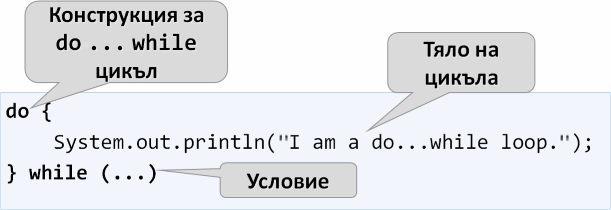

Следва обичайната поредица от примерни задачи, чиито решения ще ни помогнат да разберем по-добре **`do-while`** цикъла.

### Пример: изчисляване на факториел

За естествено число n да се изчисли **n! = 1 * 2 * 3 * … * n**. Например, ако **n = 5**, то резултатът ще бъде: 5! = 1 * 2 * 3 * 4 * 5 = **120**

Ето какви са нужните **стъпки**, за да може нашата програма да се изпълни коректно:

* Създаваме променливата **`n`**, на която присвояваме целочислена стойност взета от входа на конзолата.
* Създаваме още една променлива - **`fact`**, чиято начална стойност е 1. Нея ще използваме за изчислението и съхранението на факториела.
* За условие на цикъла ще използваме **`n > 1`**, тъй като всеки път, когато извършим изчисленията в тялото на цикъла, ще намаляваме стойността на **`n`** с 1.
* В тялото на цикъла:
   * Присвояваме нова стойност на **`fact`**, която е резултат от умножението на текущата стойност на **`fact`** с текущата стойност на **`n`**.
   * Намаляваме стойността на **`n`** с **-1**.
* Извън тялото на цикъла отпечатваме крайната стойност на факториела.


#### Тестване в Judge системата

Тествайте решението си тук: [https://judge.softuni.bg/Contests/Practice/Index/659#7](https://judge.softuni.bg/Contests/Practice/Index/659#7)  

### Пример: сумиране на цифрите на число

Да се сумират цифрите на цяло **положително** число **n**. Например, ако **n = 5634**, то резултатът ще бъде: 5 + 6 + 3 + 4 = **18**

Ето какви са нужните **стъпки**, за да може нашата програма да се изпълни коректно:
* Създаваме променливата **`n`**, на която присвояваме стойност, равна на въведеното от потребителя число.
* Създаваме втора променлива - **`sum`**, чиято начална стойност е 0. Нея ще използваме за изчислението и съхранението на резултата.
* За условие на цикъла ще използваме **`n > 0`**, тъй като след всяко изчисление на резултата в тялото на цикъла, ще премахваме последната цифра от **`n`**.
* В тялото на цикъла:
   * Присвояваме нова стойност на **`sum`**, която е резултат от събирането на текущата стойност на **`sum`** с последната цифра на **`n`**.
   * Присвояваме нова стойност на **`n`**, която е резултат от премахването на последната цифра от **`n`**.
* Извън тялото на цикъла отпечатваме крайната стойност на сумата.

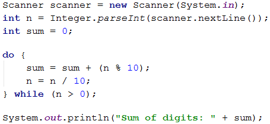

<table><tr><td></td>
<td><code><strong>n % 10</strong></code>: <b>връща</b> последната цифра на числото <code><strong>n</strong></code>.<br>
<code><strong>n / 10</strong></code>: <b>изтрива</b> последната цифра на <strong><code>n</code></strong>.</td>
</tr></table>

#### Тестване в Judge системата

Тествайте решението си тук: [https://judge.softuni.bg/Contests/Practice/Index/659#8](https://judge.softuni.bg/Contests/Practice/Index/659#8)

## Безкрайни цикли и операторът break

В настоящата глава се запознахме с различни видове цикли, като научихме какви конструкции имат те и как се прилагат. Следва да разберем какво е **безкраен цикъл**, кога възниква и как можем да **прекъснем** изпълнението му чрез оператора **`break`**.

### Безкраен цикъл. Що е то?

Безкраен цикъл наричаме този цикъл, който **повтаря безкрайно** изпълнението на тялото си. При **`while`** и **`do-while`** циклите проверката за край е условен израз, който **винаги** връща **`true`**. Безкраен **`for`** възниква, когато **липсва** параметърът за **край**. 

Ето как изглежда **безкраен `while`** цикъл:


А така изглежда **безкраен `for`** цикъл:


### Оператор break

Научихме, че безкрайният цикъл изпълнява определен код до безкрайност, но какво става, ако желаем в определен момент при дадено условие, да излезем принудително от цикъла. Тук на помощ идва операторът **`break`**, в превод - **спри, прекъсни**.

<table><tr><td></td>
<td>Операторът <b><code>break</code></b> спира изпълнението на цикъла към момента, в който е извикан. Това означава, че текущата итерация няма да бъде завършена и съответно останалата част от кода в тялото на цикъла няма да се изпълни.</td>
</tr></table>

### Пример: прости числа

В следващата задача се изисква да направим проверка за просто число. Преди да продължим към нея, нека си припомним какво са простите числа.

**Определение**: Едно число **(n)** е просто, ако се дели **единствено** на 1 и на себе си **без остатък**. Можем да приемем, че **n** е просто число, ако **не** се дели на число между 2 и n-1.

Примерни прости числа: 2, 3, 5, 7, 11, 13, 17, 19, 23, 29, 31, 37, 41, 43, …

За разлика от тях, непростите (композитни) числа са такива числа, чиято композиция е съставена от прости числа.

Ето няколко примерни непрости числа: 
*  10 = 2 * 5
* 21 = 3 * 7
* 143 = 13 * 11

**Алгоритъм за проверка** дали число е просто:
Проверяваме дали n се дели на 2, 3, …, n-1 без остатък.
* Ако се раздели, значи е композитно.
* Ако не се раздели, значи е просто.

<table><tr><td></td>
<td>Можем да оптимизираме алгоритъма, като вместо проверката да е до <code><strong>n-1</strong></code>, да се проверяват делителите до <code><strong>√𝒏</strong></code></td>
</tr></table>

### Пример: проверка за просто число. Оператор break

Да се провери дали едно число **n** е просто. Това ще направим като проверим дали **n** се дели на числата между 2 и √𝒏.

Ето какви са нужните **стъпки**, за да може нашата програма да се изпълни коректно:
* Създаваме променливата **`n`**, на която присвояваме цяло число въведено от входа на конзолата.
* Създаваме булева променлива **`isPrime`** с начална стойност **`true`**, **ако числото е по-голямо или равно на две**. Приемаме, че едно число е просто до доказване на противното.
* Създаваме **`for`** цикъл, на който като начална стойност за променливата на цикъла задаваме 2, за условие **текущата ѝ стойност `<= √𝒏`**. Стъпката на цикъла е 1.
* В **тялото на цикъла** проверяваме дали **`n`**, разделено на **текущата стойност** има остатък. Ако от делението **няма остатък**, то променяме **`isPrime`** на **`false`** и излизаме принудително от цикъла чрез оператор **`break`**.
* В зависимост от стойността на **`isPrime`** отпечатваме дали числото е просто (**`true`**) или съответно съставно (**`false`**).


#### Тестване в Judge системата

Тествайте решението си тук: [https://judge.softuni.bg/Contests/Practice/Index/659#9](https://judge.softuni.bg/Contests/Practice/Index/659#9)

### Пример: оператор break в безкраен цикъл

**Условие:** Да се напише програма, която проверява дали едно число **n** е четно, и ако е - да се отпечатва на екрана. За четно считаме число, което се дели на 2 без остатък. При невалидно число да се връща към повторно въвеждане и да се изписва съобщение, което известява, че въведеното число не е четно.

Ето какви са нужните **стъпки**, за да може нашата програма да се изпълни коректно:
* Създаваме променлива **`n`**, на която присвояваме начална стойност **0**.
* Създаваме безкраен **`while`** цикъл, като за условие ще зададем **`true`**.
* В **тялото на цикъла**:
   * Вземаме целочислена стойност от входа на конзолата и я присвояваме на **`n`**.
   * Ако **числото е четно**, излизаме от цикъла чрез **`break`**. 
   * В **противен случай** извеждаме съобщение, което гласи, че числото **не е** четно. Итерациите продължават, докато не се въведе четно число.
* Отпечатваме четното число на екрана.
* Бележка - ще обясним конструкцията **try...catch** съвсем скоро!


#### Тестване в Judge системата

Тествайте решението си тук: [https://judge.softuni.bg/Contests/Practice/Index/659#10](https://judge.softuni.bg/Contests/Practice/Index/659#10)

## Вложени цикли и операторът break

След като вече научихме какво са **вложените цикли** и как работи операторът **`break`**, е време да разберем как работят двете заедно. За по-добро разбиране, нека стъпка по стъпка да напишем **програма**, която трябва да направи всички възможни комбинации от **двойка числа**. Първото число от комбинацията е нарастващо от 1 до 3, а второто е намаляващо от 3 до 1. Задачата трябва да продължи изпълнението си, докато **`i + j`** **не** е равно на 2 (т.е. **`i = 1`** и **`j = 1`**).

Желаният резултат е:


**Грешно** решение:


Ако оставим програмата ни по този начин, резултатът ни ще е

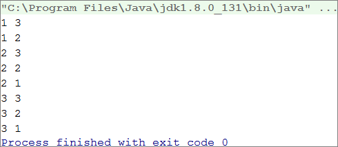

Защо се получава така? Както виждаме, в резултата **липсва "1 1"**. Когато програмата стига до там, че **`i = 1`** и **`j = 1`**, тя влиза в **`if`** проверката и изпълнява **`break`** операцията. По този начин се излиза от вътрешния цикъл, но след това продължава изпълнението на външния. **`i`** нараства, програмата влиза във вътрешния цикъл и принтира резултата.

<table><tr><td></td>
<td>Когато във <b>вложен цикъл</b> използваме оператора <b><code>break</code></b>, той прекъсва изпълнението <b>само</b> на вътрешния цикъл.</td>
</tr></table>

Какво е **правилното решение**? Един начин за решаването на този проблем е чрез деклариране на **`bool` променлива**, която следи за това, дали трябва да продължава въртенето на цикъла. Цялото решение на задачата:


По този начин, когато **`i + j = 2`**, програмата ще направи променливата **`hasToEnd = true`** и ще излезе от вътрешния цикъл. При следващото завъртане на външния цикъл, чрез **`if`** проверката, програмата няма да може да стигне до вътрешния цикъл и ще прекъсне изпълнението си.

## Справяне с грешни данни: try-catch

Последното, с което ще се запознаем в тази глава, е как да "улавяме" **грешни данни** чрез конструкцията **`try-catch`**.

### Какво е try-catch?

**`Try-catch`** е конструкция, която служи за проверка на обработваните данни и реагиране при **изключения** и **грешки** в тях.

**Изключенията** (exceptions) най-често представляват уведомление за дадено събитие, което нарушава нормалната работа на една програма. Грешки от типа exception **прекъсват изпълнението** на програмата ни. Когато настъпят, се казва, че изключението е **"хвърлено" (throw exception)**. От там идва и израза **"улавям изключение" (catch exception)**. 

### Конструкция на try-catch

**`Try-catch`** има различни видове конструкции, но за сега ще се запознаем само с най-основната: 

 

В следващата задача ще видим нагледно, как да се справим в ситуация, в която потребителят въвежда вход, различен от число (например **`string`** вместо **`int`**), чрез **`try-catch`**.

### Пример: Справяне с грешни числа чрез try-catch

Да се напише програма, която проверява дали едно число **n** е четно и ако е, да се отпечатва на екрана. При **невалидно въведено** число да се изписва съобщение, което известява, че въведения вход не е валидно число.

Ето какви са нужните **стъпки**, за да може нашата програма да се изпълни коректно:

* Създаваме **`try-catch`** конструкция.
* В **`try`** блока пишем програмната логика за взимане на потребителския вход и проверката за четност.
* Ако **хванем изключение** при изпълнението на **`try`** блока, изписваме съобщение за невалидно въведено число.


#### Тестване в Judge системата

Тествайте решението си тук: [https://judge.softuni.bg/Contests/Practice/Index/659#10](https://judge.softuni.bg/Contests/Practice/Index/659#10)


## Задачи с цикли

В тази глава се запознахме с няколко нови вида цикли, с които могат да се правят повторения с по-сложна програмна логика. Да решим няколко задачи, използвайки новите знания.

### Задача: числа на Фибоначи

Числата на Фибоначи в математиката образуват редица, която изглежда по следния начин: **1, 1, 2, 3, 5, 8, 13, 21, 34, …**.

**Формулата** за образуване на редицата е:

```java
F0 = 1
F1 = 1
Fn = Fn-1 + Fn-2
```

#### Примерен вход и изход

|Вход (n)|Изход|Коментар|
|----|-----|---------|
|10|89|F(11) = F(9) + F(8)|
|5|8|F(5) = F(4) + F(3)|
|20|10946|F(20) = F(19) + F(18)|
|0|1| |
|1|1| |

Да се въведе **цяло** число n и да се пресметна n-тото число на Фибоначи

#### Насоки и подсказки

Ето какви са нужните **стъпки**, за да може нашата програма да се изпълни коректно:

* Създаваме **променлива `n`**, на която присвояваме целочислена стойност от входа на конзолата.
* Създаваме променливите **`f0`** и **`f1`**, на които присвояваме стойност **1**, тъй като така започва редицата.
* Създаваме **`for`** цикъл с условие **текущата стойност `i < n - 1`**.
* В **тялото на цикъла:**
   * Създаваме **временна** променлива **`fNext`**, на която присвояваме следващото число в поредицата на Фибоначи.
   * На **`f0`** присвояваме текущата стойност на **`f1`**.
   * На **`f1`** присвояваме стойността на временната променлива **`fNext`**.
* Извън цикъла отпечатваме числото n-тото число на Фибоначи.


#### Тестване в Judge системата

Тествайте решението си тук: [https://judge.softuni.bg/Contests/Practice/Index/659#11](https://judge.softuni.bg/Contests/Practice/Index/659#11)

### Задача: пирамида от числа

Да се отпечатат числата 1...n в пирамида като в примерите:

#### Примерен вход и изход

|Вход      |Изход          |Вход      |Изход          |
|----------|---------------|----------|---------------|
|7         |1<br>2 3<br>4 5 6<br>7    |10    |1<br>2 3<br>4 5 6<br>7 8 9 10 |

#### Насоки и подсказки

Ето какви са нужните **стъпки**, за да може нашата програма да се изпълни коректно:

* Създаваме променлива **`n`**, на която присвояваме целочислена стойност от входа на конзолата.
* Създаваме променлива **`num`** с начална стойност 1. Тя ще пази броя на отпечатаните числа. При всяка итерация ще я **увеличаваме** с **1** и ще я принтираме.
* Създаваме **външен** **`for`** цикъл, който ще отговаря за **редовете** в таблицата. Наименуваме променливата на цикъла **`row`** и ѝ задаваме начална стойност 0. За условие слагаме **`row < n`**. Размерът на стъпката е 1.
* В тялото на цикъла създаваме **вътрешен** **`for`** цикъл, който ще отговаря за **колоните** в таблицата. Наименуваме променливата на цикъла **`col`** и ѝ задаваме начална стойност 0. За условие слагаме **`col < row`** (**`row`** = брой цифри на ред). Размерът на стъпката е 1.
* В тялото на вложения цикъл:
   * Проверяваме дали **`col > 1`**, ако да – принтираме разстояние. Ако не направим тази проверка, а директно принтираме разстоянието, ще имаме ненужно такова в началото на всеки ред.
   * **Отпечатваме** числото **`num`** в текущата клетка на таблицата и го **увеличаваме с 1**.
   * Правим проверка за **`num > n`**. Ако **`num`** е по-голямо от **`n`**, **прекъсваме** въртенето на **вътрешния цикъл**.
* Отпечатваме **празен ред**, за да преминем на следващия.
* Отново проверяваме дали **`num > n`**. Ако е по-голямо, **прекъсваме** изпълнението на **програмата ни** чрез `break`. 


#### Тестване в Judge системата

Тествайте решението си тук: [https://judge.softuni.bg/Contests/Practice/Index/659#12](https://judge.softuni.bg/Contests/Practice/Index/659#12)

### Задача: таблица с числа

Да се отпечатат числата 1…n в таблица като в примерите:

#### Примерен вход и изход

|Вход |Изход|Вход|Изход|
|--------|-----|-------|-----|
|3|1 2 3<br>2 3 2<br>3 2 1|4|1 2 3 4<br>2 3 4 3<br>3 4 3 2<br>4 3 2 1|

#### Насоки и подсказки

Ето какви са нужните **стъпки**, за да може нашата програма да се изпълни коректно:

* Създаваме променлива **`n`**, на която присвояваме целочислена стойност от входа на конзолата.
* Създаваме **`for`** цикъл, който ще отговаря за редовете в таблицата. Наименуваме променливата на цикъла **`row`** и ѝ задаваме начална **стойност 0**. За условие слагаме **`row < n`**. Размерът на стъпката е 1.
* В **тялото на цикъла** създаваме вложен **`for`** цикъл, който ще отговаря за колоните в таблицата. Наименуваме променливата на цикъла **`col`** и ѝ задаваме начална **стойност 0**. За условие слагаме **`col < n`**. Размерът на стъпката е 1.
* В **тялото на вложения цикъл**:
   * Създаваме променлива **`num`**, на която присвояваме резултата от **текущият ред + текущата колона + 1** (+ 1, тъй като започваме броенето от 0).
   * Правим проверка за **`num > n`**. Ако **`num`** е **по-голямо** от n, присвояваме нова стойност на **`num`** равна на **два пъти n - текущата стойност за `num`**. Това правим с цел да не превишаваме **`n`** в никоя от клетките на таблицата.
    * Отпечатваме числото от текущата клетка на таблицата.
* Отпечатваме **празен ред** във външния цикъл, за да преминем на следващия ред.


#### Тестване в Judge системата

Тествайте решението си тук: [https://judge.softuni.bg/Contests/Practice/Index/659#13](https://judge.softuni.bg/Contests/Practice/Index/659#13)

## Какво научихме от тази глава?

Можем да използваме **`for`** цикли със **стъпка**:

```java
for (int i = 1; i <= n; i+=3) {
   System.out.println(i);
}
```

Циклите **`while`**/**`do-while`** се повтарят докато е в сила дадено **условие**:

```java
int num = 1;
while (num <= n) {
   System.out.println(num++);
}
```

Ако се наложи да **прекъснем** изпълнението на цикъл, го правим с оператора **`break`**:

```java
int n = 0;
while (true) {
   n = Integer.parseInt(scanner.nextLine());
   if (n % 2 == 0)  {
      break; // even number -> exit from the loop
   }
   System.out.println("The number is not even.");
}
System.out.println("Even number entered: {0}", n);
```

Вече знаем как да следим за **грешки** по време на изпълнението на програмата ни:

```java
try {
   System.out.println("Enter even number: ");
   n = Integer.parseInt(scanner.nextLine());
} catch 
   System.out.println("Invalid number."); 
}
// Ако Integer.parseInt(…) гръмне, ще се изпълни catch { … } блокът
```


## Упражнения: уеб приложения с по-сложни цикли - TODO - TILL MONDAY AFTERNOON

Сега вече знаем как да повтаряме група действия, използвайки **цикли**. Нека направим нещо интересно: да си направим **уеб базирана игра**. Да, истинска игра, с графика, с гейм логика. Да се позабавляваме. Ще бъде сложно, но ако не разберете нещо как точно работи, няма проблем. Сега още навлизаме в програмирането. Има време, ще напреднете с технологиите. Засега следвайте стъпките.

### Празно Visual Studio решение (Blank Solution)

Създайте празно решение **(Blank Solution)** във Visual Studio, за да организирате кода от задачите за упражнение. Целта на този **blank solution** e да съдържа **по един проект за всяка задача** от упражненията.


Задайте **да се стартира по подразбиране текущия проект** (не първият в решението). Кликнете с десен бутон на мишката върху **Solution 'Complex-Loops'** -> [**Set StartUp Projects…**] -> [**Current selection**].

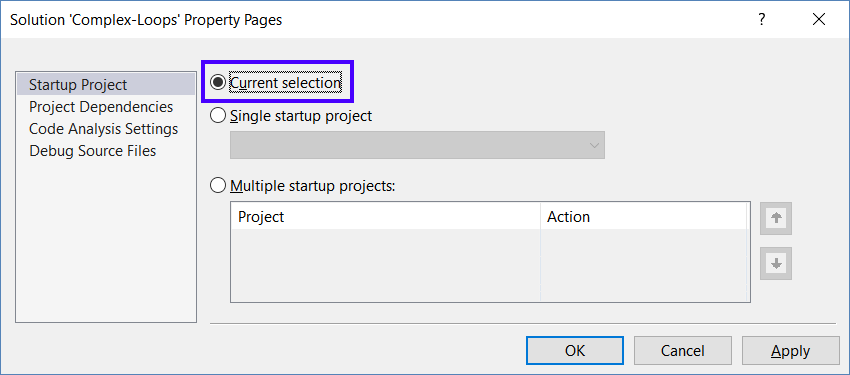


### Задача: уеб игра „Обстреляй плодовете!“

**Условие**: Да се разработи **ASP.NET MVC уеб приложение** – игра, в която играчът **стреля по плодове**, подредени в таблица. Успешно уцелените плодове изчезват, а играчът получава точки за всеки уцелен плод. При уцелване на **динамит**, плодовете се взривяват и играта свършва (както във Fruit Ninja).
Стрелбата се извършва по колони, отгоре надолу или отдолу нагоре, а местоположението на удара (колоната под обстрел) се задава чрез скролер (scroll bar). Заради неточността на скролера, играчът не е съвсем сигурен по коя колона ще стреля. Така при всеки изстрел има шанс да не улучи и това прави играта по-интересна (подобно на прашката в Angry Birds).

Играта ни трябва да изглежда по този начин:

 

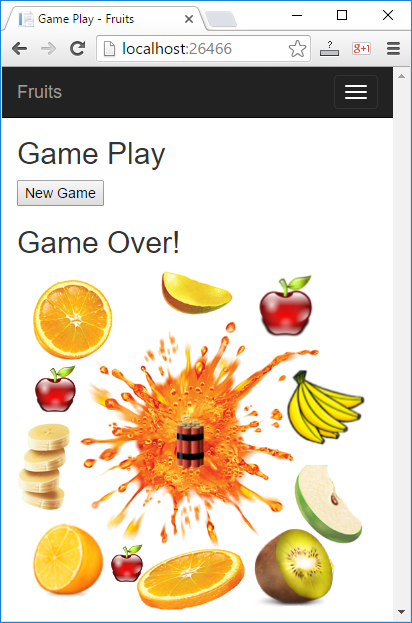

Ето какви са нужните **стъпки**, за да може нашата програма да се изпълни коректно:

Във Visual Studio създаваме ново **ASP.NET MVC уеб приложение** с език C#. Добавяме нов проект от [**Solution Explorer**] &rarr; [**Add**] &rarr; [**New Project…**]. Задаваме смислено име, например “**Fruits-Web-Game**”:

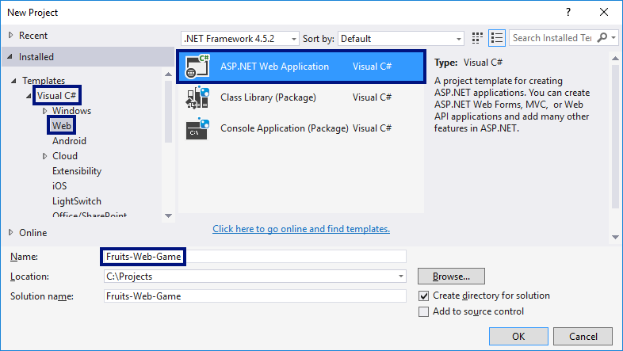 

След това избираме тип на уеб приложението "MVC":

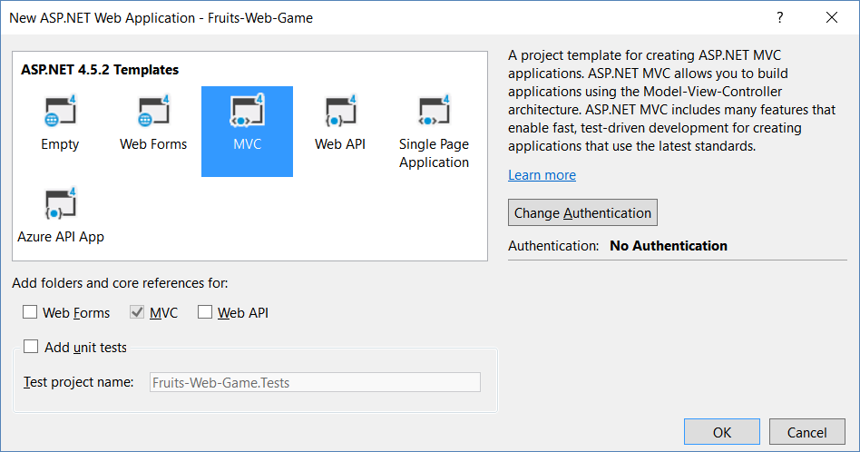 

Сега създаваме контролите за играта. Целта е да добавим **скролиращи ленти** (scroll bars), с които играчът се прицелва, и бутон за старт на **нова игра**. Затова трябва да редактираме файла **`Views/Home/Index.cshtml`**. Изтриваме всичко в него и въвеждаме кода от картинката:
  
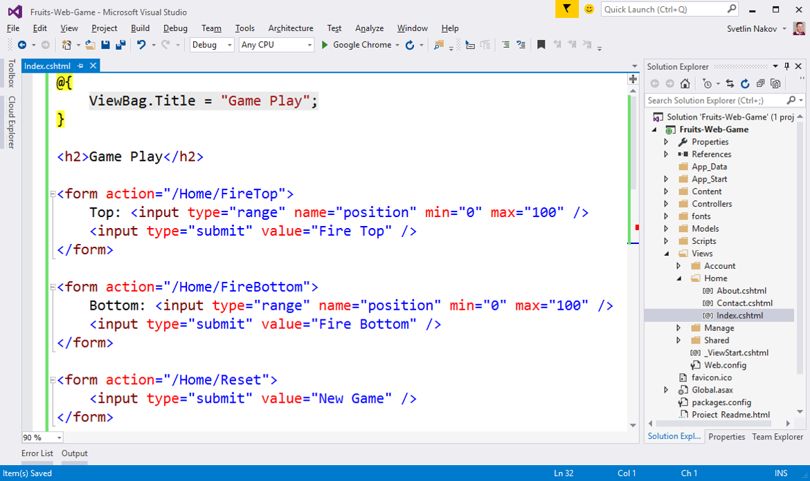 

Този код създава уеб форма **`<form>`** със скролер (поле) **`position`** за задаване на число в интервала [**0…100**] и бутон [**Fire Top**] за изпращане на данните от формата към сървъра. Действието, което ще обработи данните, се казва **`Home/FireTop`**, което означава метод **`FireTop`** в контролер **`Home`**, който се намира във файла **`HomeController.cs`**. Следват още две подобни форми с бутони [**Fire Bottom**] и [**New Game**].

Сега трябва да подготвим плодовете за рисуване в изгледа (view). Добавяме следния код в контролера: **`Controllers/HomeController.cs`**:

 

Горният код дефинира полета за **брой редове, брой колони**, за **таблицата с плодовете** (игралното поле), за натрупаните от играча **точки** и информация дали играта е активна или е **свършила** (поле **`gameOver`**). Игралното поле е с размери 9 колони на 3 реда и съдържа за всяко поле текст какво има в него: **`apple`, `banana`, `orange`, `kiwi`, `empty` или `dynamite`**.
Главното действие **`Index()`** подготвя игралното поле за чертане като записва във **`ViewBag`** структурата елементите на играта и извиква изгледа, който ги чертае в страницата на играта в уеб браузъра като HTML.

Трябва да генерираме случайни плодове. За да направим това, трябва да напишем метод **`GenerateRandomFruits()`** с кода от картинката по-долу. Този код записва в таблицата (матрицата) **`fruits`** имена на различни картинки и така изгражда игралното поле. Във всяка клетка от таблицата се записва една от следните стойности: **`apple`, `banana`, `orange`, `kiwi`, `empty` или `dynamite`**. След това, за да се нарисува съответното изображение в изгледа, към текста от таблицата ще се долепи **`.png`** и така ще се получи името на файла с картинката, която да се вмъкне в HTML страницата като част от игралното поле. Попълването на игралното поле (9 колони с по 3 реда) става в изгледа **`Index.cshtml`** с два вложени **`for`** цикъла (за ред и за колона).

За да се генерират случайни плодове за всяка клетка се генерира **случайно число** между 0 и 8 (вж. класа **`Random`** в .NET). Ако числото e 0 или 1, се слага **`аpple`**, ако е между 2 и 3, се слага **`banana`** и т.н. Ако числото е 8, се поставя **`dynamite`**. Така плодовете се появяват 2 пъти по-често отколкото динамита. Ето и кода:

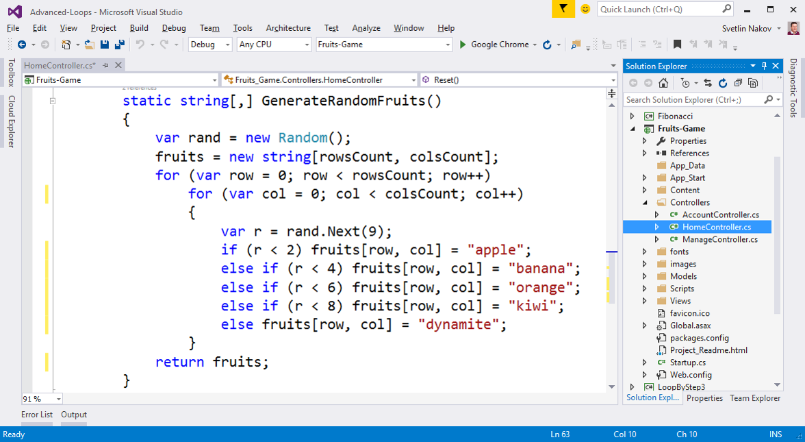 

**Добавяме картинките** за играта. 

От [**Solution Explorer**] създаваме папка **"images"** в коренната директория на проекта. Използваме менюто [**Add**] &rarr; [**New Folder**]. 
 
Сега добавяме **картинките** за играта (те са част от файловете със заданието за този проект и могат да бъдат свалени от [тук](https://github.com/SoftUni/Programming-Basics-Book-Java-BG/tree/master/assets/chapter-7-1-assets)). Копираме ги от Windows Explorer и ги поставяме в папката **"images"** в [**Solution Explorer**] във Visual Studio с **copy/paste**.

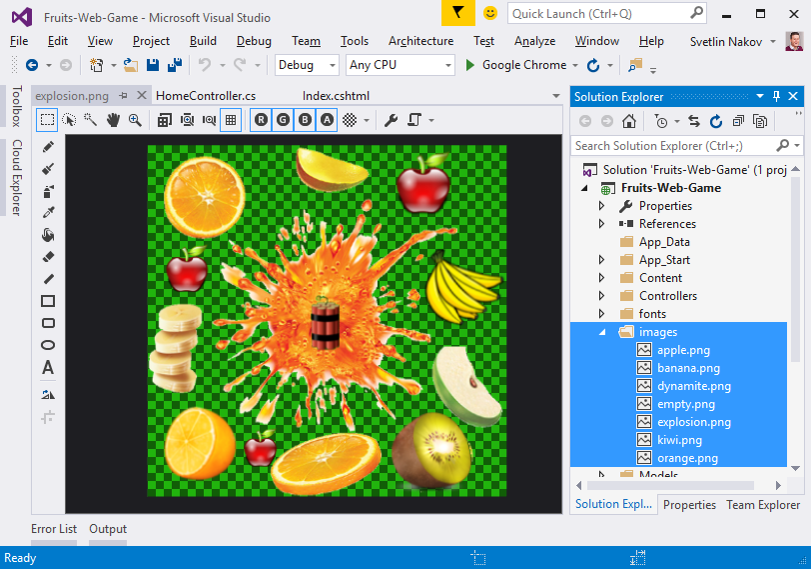 

Чертане на плодовете в **`Index.cshtml`**:

За да **начертаем игралното поле** с подовете, трябва да завъртим **два вложени цикъла** (за редовете и за колоните). Всеки ред се състои от 9 на брой картинки, всяка от които съдържа **`apple`, `banana`** или друг плод, или празно **`empty`**, или динамит **`dynamite`**. Картинките се чертаят като се отпечата HTML таг за вмъкване на картинка от вида на **``**. Девет картинки се подреждат една след друга на всеки от редовете, а след тях се преминава на нов ред с **`<br>`**. Това се повтаря три пъти за трите реда. Накрая се отпечатват точките на играча. Ето как изглежда **кодът** за чертане на игралното поле и точките:

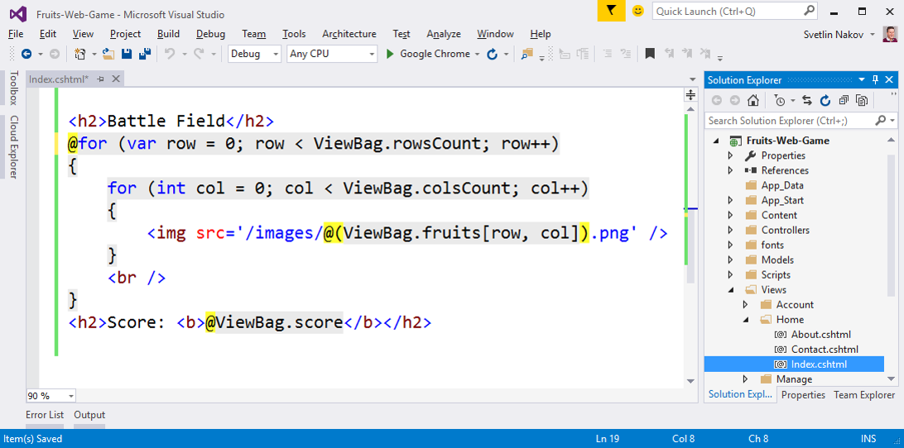 

Обърнете внимание на жълтите символи **`@`** – те служат за превключване между езика **C#** и езика **HTML** и идват от **Razor** синтаксиса за рисуване на динамични уеб страници.

Следва да нагласим текстовете във файла **`/Views/Shared/_Layout.cshtml`**. Заменяме **`My ASP.NET Application`** с по-подходящ текст, напр. **`Fruits`**:

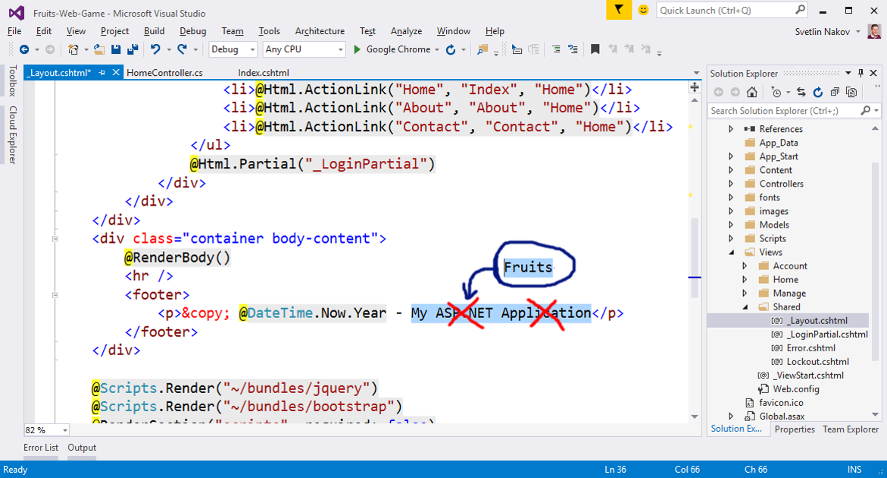 

Стартираме проекта с [**Ctrl+F5**] и му се порадвайте. Очаква се да бъде генерирано случайно игрово поле с плодове с размери 9 на 3 и да се визуализира в уеб страницата чрез поредица картинки:

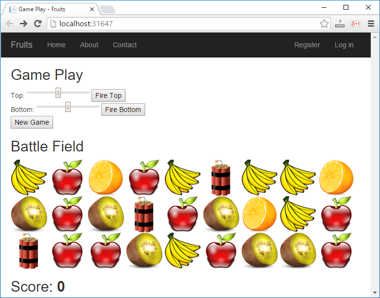 

Сега играта е донякъде направена: игралното поле се генерира случайнo и се визуализира успешно (ако не сте допуснали грешка някъде). Остава да се реализира същината на играта: **стрелянето по плодовете**.

За целта добавяме действията [**New Game**] и [**Fire Top**]/[**Fire Top**] в контролера **`HomeController.cs`**:

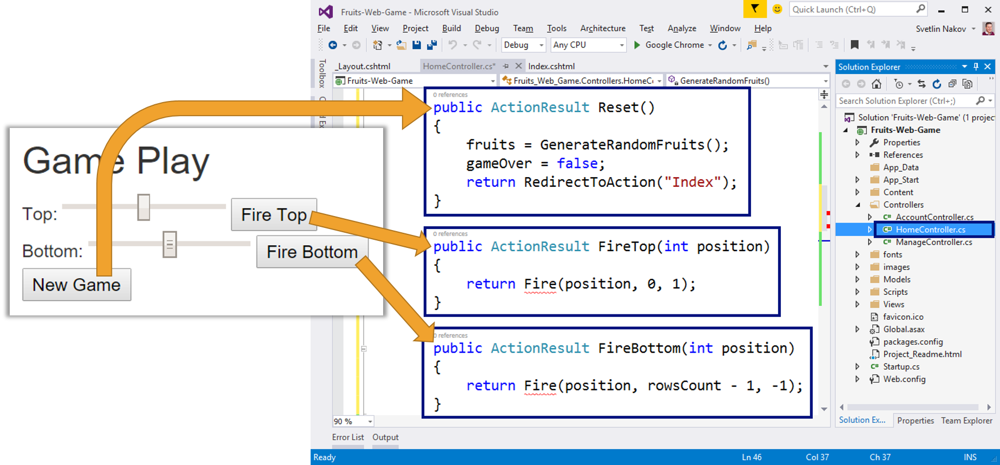 

Горният код дефинира три действия:
*	**`Reset()`** – стартира нова игра, като генерира новo случайно игрално поле с плодове и експлозиви, нулира точките на играча и прави играта валидна **(`gameOver = false`)**. Това действие е доста просто и може да се тества веднага с [**Ctrl+F5**], преди да се напишат другите.
*	**`FireTop(position)`** – стреля по ред **0** на позиция **`position`** (число от 0 до 100). Извиква се стреляне в посока **надолу** (+1) от ред **`0`** (най-горния). Самото стреляне е по-сложно като логика и ще бъде разгледано след малко.
*	**`FireBottom(position)`** – стреля по ред **2** на позиция **`position`** (число от 0 до 100). Извиква се стреляне в посока **нагоре** (-1) от ред **2** (най-долния).

Имплементираме "стрелянето" – метода **`Fire(position, startRow, step)`**:

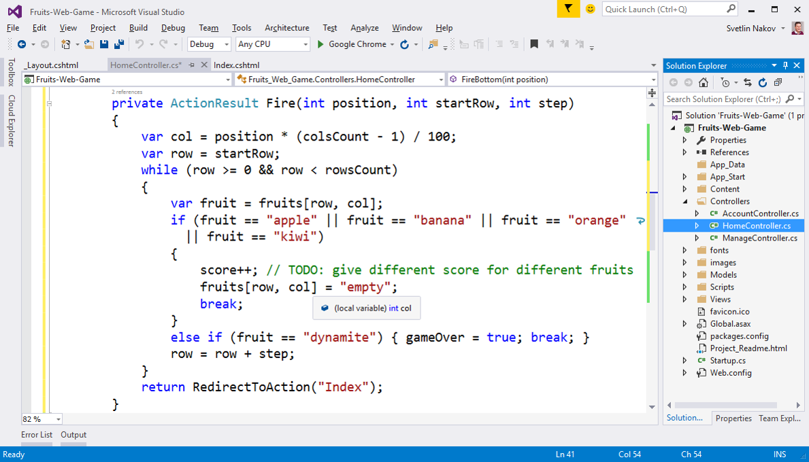

Стрелянето работи по следния начин: първо се изчислява номера на колоната **`col`**, към която играчът се е прицелил. Входното число от скролера (между 0 и 100) се намалява до число между 0 и 8 (за всяка от 9-те колони). Номерът на реда **row** е или 0 (ако изстрелът е отгоре) или броят редове минус едно (ако изстрелът е отдолу). Съответно посоката на стрелба (стъпката) е **1** (надолу) или **-1** (нагоре).

За да се намери къде изстрелът поразява плод или динамит, се преминава в цикъл през всички клетки от игралното в прицелената колона и от първия до последния атакуван ред. Ако се срещне плод, той изчезва (замества се с **`empty`**) и се дават точки на играча. Ако се срещне **`dynamite`**, играта се отбелязва като свършила.

Оставаме на по-запалените да имплементират по-сложно поведение, например да се дават различни точки при уцелване на различен плод, да се реализира анимация с експлозия (това не е твърде лесно), да се взимат точки при излишно стреляне в празна колона и подобни.

**Тестваме** какво работи до момента като стартираме с [**Ctrl+F5**]:
*	**Нова игра** &rarr; бутонът за нова игра трябва да генерира ново игрално поле със случайно разположени плодове и експлозиви и да нулира точките на играча.
*	**Стреляне отгоре** &rarr; стрелянето отгоре трябва да премахва най-горният плод в уцелената колона или да предизвиква край на играта при динамит. Всъщност при край на играта все още нищо няма да се случва, защото в изгледа този случай още не се разглежда.
* **Стреляне отдолу** &rarr; стрелянето отдолу трябва да премахва най-долния плод в уцелената колона или да прекратява играта при уцелване на динамит.


 
За момента при **"Край на играта"** нищо не се случва. Ако играчът уцели динамит, в контролера се отбелязва, че играта е свършила **(`gameOver = true`)**, но този факт не се визуализира по никакъв начин. За да заработи приключването на играта, е необходимо да добавим няколко проверки в изгледа:

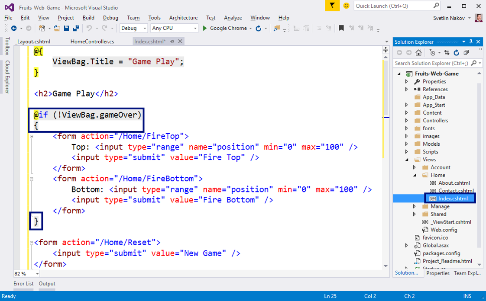

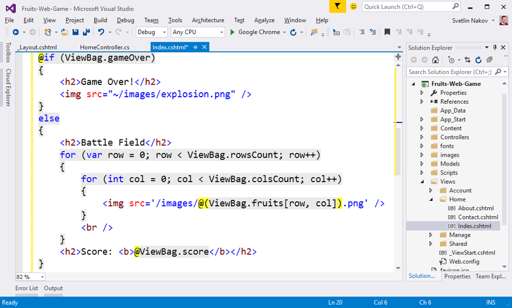

Кодът по-горе проверява дали е свършила играта и показва съответно контролите за стреляне и игралното поле (при активна игра) или картинка с експлодирали плодове при край на играта.

След промяната в кода на изгледа стартираме с [**Ctrl+F5**] и **тестваме** играта отново:

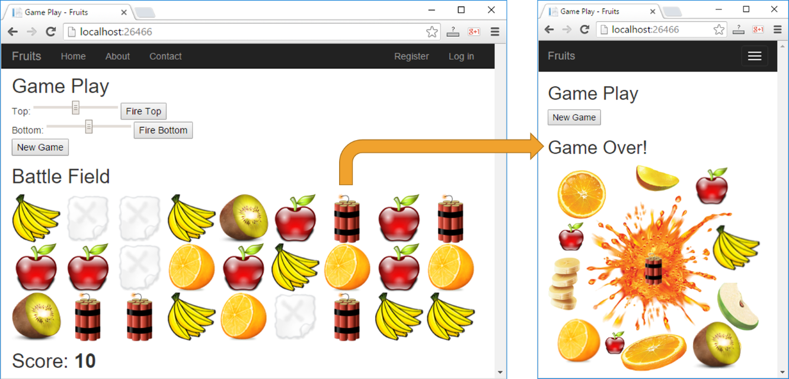

Този път при уцелване на динамит, трябва да се появи дясната картинка и да се позволява единствено действието "нова игра" (бутонът [**New Game**]).

Сложно ли беше? Успяхте ли да направите играта? Ако не сте успяли, спокойно, това е сравнително сложен проект, който включва голяма доза неизучавана материя. Ако искате уеб игричката да ви тръгне в ръцете, **гледайте видеото** в началото на тази глава и следвайте стъпките от него. Там приложението е направено на живо с много обяснения. Или питайте за конкретни проблеми във **форума на СофтУни**: https://softuni.bg/forum.
